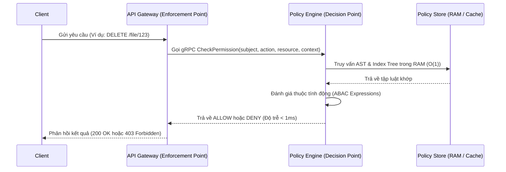

# Standalone PBAC/ABAC Policy Engine (PDP)

Một động cơ phân quyền độc lập động (Dynamic Authorization Decision Engine) hiệu năng cao viết bằng Golang, được tối ưu hóa cho kiến trúc Microservices và Cloud-Native SaaS.

---

## 🎯 Tổng quan Kiến trúc

Hệ thống hoạt động theo mô hình chuẩn **XACML / NIST Attribute-Based Access Control**:

### Các thành phần chính:
1.  **Policy Decision Point (PDP - Core Engine):** Dịch vụ Go gRPC độc lập chịu trách nhiệm phân tích, lưu trữ cây luật phân quyền trên RAM và đưa ra quyết định phân quyền cuối cùng.
2.  **Lexer/Parser (AST Engine):** Biên dịch các quy tắc viết bằng ngôn ngữ khai báo tương tự Cedar thành dạng cây biểu diễn logic AST trên RAM.
3.  **In-Memory Policy Indexer:** Tổ chức lưu trữ luật phân quyền bằng cấu trúc dữ liệu Trie/Map lồng nhau dựa trên các tiền tố `subject` (ví dụ: `user:*`) và `resource` để đạt tốc độ tìm kiếm tiệm cận `O(1)`.

---

## ⚡ Chỉ số Hiệu năng Mục tiêu

*   **Độ trễ xử lý (Latency):**
    *   Trung bình: `< 0.3 ms`
    *   Phần trăm thứ 99 (P99): `< 1.0 ms` dưới áp lực tải lớn.
*   **Thông lượng (Throughput):**
    *   `> 15,000 requests/giây` trên mỗi luồng CPU đơn nhân.
*   **Độ tin cậy (Success Rate):** `100%` không có hiện tượng rò rỉ bộ nhớ (memory leaks).

---

## 📅 Lộ trình Triển khai (Roadmap)

### Phase 1: Kiến trúc Bộ nhớ & Parser
- [ ] Thiết kế cú pháp khai báo chính sách (Policy Grammar).
- [ ] Viết Parser biên dịch chuỗi chính sách thành cây biểu thức logic AST.
- [ ] Phát triển In-Memory Indexer lưu trữ các nút chính sách bằng Trie/Graph.

### Phase 2: Core Decision Engine
- [ ] Xây dựng bộ đánh giá thuộc tính động (ABAC Evaluator) trên AST.
- [ ] Hiện thực hóa cơ chế đồng bộ thread-safe qua `sync.RWMutex`.
- [ ] Tích hợp `sync.Pool` để triệt tiêu việc cấp phát lại các node AST.

### Phase 3: gRPC Server & Protobuf Layer
- [ ] Biên dịch file Protobuf và dựng gRPC Server HTTP/2.
- [ ] Thiết lập chính sách nén dữ liệu Protobuf và Keepalive để tối ưu hóa đường truyền mạng.

### Phase 4: Stress-Testing & Benchmark Reports
- [ ] Viết benchmark so sánh trực tiếp với Open Policy Agent (OPA).
- [ ] Chạy stress test 50,000 requests song song bằng `ghz`.
- [ ] Xuất báo cáo thời gian phản hồi (Latency Distribution) làm tài liệu thực nghiệm.
