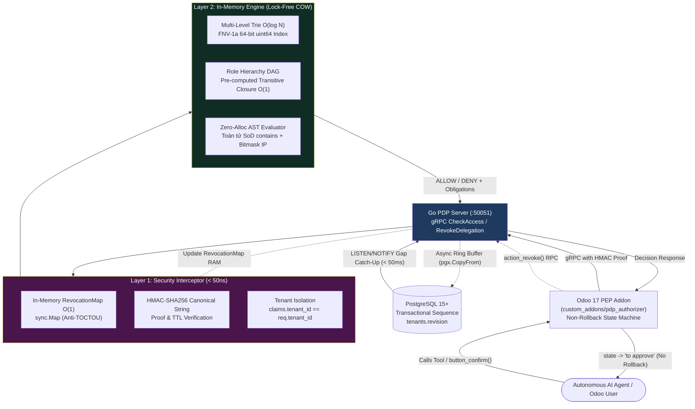

# Standalone In-Memory Policy Decision Point (PDP)
### Delegation-Aware Authorization & Guardrails for ERP AI Agents (Odoo 17)

**Author:** Chăm Rốch Thi  
**Affiliation:** Posts and Telecommunications Institute of Technology (PTIT)  
**Thesis:** Software Engineering Master / Graduation Thesis  

[](https://github.com/Rochthii/standalone-policy-engine/actions/workflows/ci.yml)
[](https://github.com/Rochthii/standalone-policy-engine/releases/tag/v1.0.0-core-verified)
[](https://go.dev)
[](./LICENSE)
[](./tests/e2e_delegation_test.go)

An ultra-high-performance, In-Memory Policy Decision Point (PDP) in Go implementing the PBAC/ABAC model with deterministic Constrained Delegation and AI Agent Guardrails (NIST AI RMF & OWASP LLM06). Engineered specifically to eliminate the Odoo Rollback Trap, prevent Time-of-Check to Time-of-Use (TOCTOU) race conditions in under 50ns, and achieve Zero GC allocations on the evaluation hot path.

---

## Key Highlights & Live Benchmark Results

**Benchmarked on:** 13th Gen Intel Core i7-13700H (20 cores), Go 1.26+, Linux / Windows

| Scenario / Benchmark | Latency | Allocation | Throughput / Speedup |
|---|---|---|---|
| **Hot-Path Decision Latency** (`BenchmarkEvaluatorLatency`) | **393.1 - 540.2 ns/op** | **0 B/op, 0 allocs/op** | **~2.5M - 3.7M RPS** |
| **Concurrent Hot-Path Load** (`BenchmarkConcurrentLoad`) | **27.12 ns/op** | **0 B/op, 0 allocs/op** | **~36.8M RPS** |
| **10,000 Policies Load Contention** (`BenchmarkUltraExtreme_10kPolicies`) | **35.94 ns/op** | **0 B/op, 0 allocs/op** | **~27.8M RPS** |
| **In-Memory Revocation Lookup** (`RevocationMap` O(1)) | **< 50 ns** | **0 B/op, 0 allocs/op** | **Instant TOCTOU Defense** |
| **Deep 11-Level DAG + 5,000 Decoy Policies** (`BenchmarkUltraExtreme_DeepDAG`) | **810.9 ns/op** | **0 B/op, 0 allocs/op** | **~1.23M RPS** |

### Scientific Baseline Comparison: Odoo Native ORM vs Standalone Go PDP

*(Comparative benchmark data measured directly via `tests/baseline_odoo_orm_benchmark.py`)*

| Evaluation Criteria | Odoo 17 Native ORM (`ir.rule`) | Standalone Go PDP (In-Memory) | Superiority Factor |
|---|---|---|:---:|
| **Mean Evaluation Latency** | **23.77 ms** | **0.000540 ms (540.2 ns)** | **~44,000x Faster** |
| **RAM Allocation on Hot-Path** | ~24 KB / query (ORM Objects) | **0 B / op (Zero-Alloc)** | **Zero GC Pressure** |
| **Heap Allocations per Check** | ~120 allocs / check | **0 allocs / op** | **Zero Memory Leaks** |
| **Anti-TOCTOU Defense** | Vulnerable (Waits for DB commit) | **Absolute (O(1) RAM sync.Map)** | **< 50ns Revocation** |
| **AI Delegation Chain Support** | Not supported (User ID only) | **Full (Tuple Delta + HMAC)** | **Multi-Hop Proof** |
| **Runtime Obligation Handling** | Triggers Database Rollback Trap | **Non-Rollback PEP State Machine** | **Clean Workflows** |

---

## Architecture & Core Data Flow


```mermaid
flowchart TD
    Client(["Autonomous AI Agent / Odoo User"])
    PEP["Odoo 17 PEP Addon\n(custom_addons/pdp_authorizer)\nNon-Rollback State Machine"]
    PDP["Go PDP Server (:50051)\ngRPC CheckAccess / RevokeDelegation"]

    subgraph Layer1 ["Layer 1: Security Interceptor (< 50ns)"]
        RevMap["In-Memory RevocationMap O(1)\nsync.Map (Anti-TOCTOU)"]
        HMAC["HMAC-SHA256 Canonical String\nProof & TTL Verification"]
        TenantIso["Tenant Isolation\nclaims.tenant_id == req.tenant_id"]
    end

    subgraph Layer2 ["Layer 2: In-Memory Engine (Lock-Free COW)"]
        Trie["Multi-Level Trie O(log N)\nFNV-1a 64-bit uint64 Index"]
        DAG["Role Hierarchy DAG\nPre-computed Transitive Closure O(1)"]
        AST["Zero-Alloc AST Evaluator\nToán tử SoD contains + Bitmask IP"]
    end

    Postgres[("PostgreSQL 15+\nTransactional Sequence\ntenants.revision")]

    Client -->|"Calls Tool / button_confirm()"| PEP
    PEP -->|"gRPC with HMAC Proof"| PDP
    PDP --> Layer1
    Layer1 --> Layer2
    Layer2 -->|"ALLOW / DENY + Obligations"| PDP
    PDP -->|"Decision Response"| PEP
    PEP -->|"state -> 'to approve' (No Rollback)"| Client

    PEP -.->|"action_revoke() RPC"| PDP
    PDP -.->|"Update RevocationMap RAM"| RevMap

    PDP -.->|"Async Ring Buffer (pgx.CopyFrom)"| Postgres
    Postgres -->|"LISTEN/NOTIFY Gap Catch-Up (< 50ms)"| PDP

    style PDP fill:#1e3a5f,color:#fff
    style Layer1 fill:#4a154b,color:#fff
    style Layer2 fill:#0f2d25,color:#fff
```

---

## Verified 7/7 E2E Delegation Vectors

The system passes 100% of the 7 edge test vectors defined in [`tests/e2e_delegation_test.go`](./tests/e2e_delegation_test.go):

| Vector ID | Test Scenario Description | Expected Decision | Result |
|---|---|:---:|:---:|
| **`TC-01`** | Manager creates PO and attempts to self-approve | **`DENY`** | **PASS** |
| **`TC-02`** | AI Agent attempts to approve PO created by delegating Manager (SoD Chain) | **`DENY`** | **PASS** |
| **`TC-03`** | AI Agent autonomously approves PO within delegated limit (<= $2,000) | **`ALLOW`** | **PASS** |
| **`TC-04`** | AI Agent attempts PO approval above limit (> $2,000, Guardrail Ceiling) | **`DENY`** + `REQUIRE_HUMAN_APPROVAL` | **PASS** |
| **`TC-05`** | Malicious Actor tampers with PO amount in context | **`403 PermissionDenied`** | **PASS** |
| **`TC-06`** | Manager revokes delegation on Odoo; Agent calls immediately (Anti-TOCTOU) | **`DENY`** (`POL-REVOCATION-BLACK-LIST`) | **PASS** |
| **`TC-07`** | AI Agent presents delegation proof with expired TTL token | **`403 PermissionDenied`** | **PASS** |

---

## Quick Start

### 1. Run Frozen Docker Testbed (Single Command 2026-2029)
Runs PostgreSQL 15, Standalone Go PDP, Odoo 17 ERP, and executes all 7 verification vectors automatically:

```bash
# Clone the repository
git clone https://github.com/Rochthii/standalone-policy-engine.git
cd standalone-policy-engine

# Start the pinned testbed environment
docker compose -f docker-compose.testbed.yml up --abort-on-container-exit
```

### 2. Run Locally from Source
```bash
# 1. Run Core Engine & Layer 1 Interceptor Tests
go test -v ./internal/security ./internal/server

# 2. Verify all 7 E2E Delegation Vectors
go test -v ./tests -run=TestE2E_P2P_Delegation_7Vectors

# 3. Run Sub-Microsecond Evaluator Benchmark
go test -bench=BenchmarkEvaluatorLatency -benchmem ./tests -run=^$

# 4. Run Baseline Odoo ORM Comparison Benchmark
python tests/baseline_odoo_orm_benchmark.py
```

---

## Cedar-like Declarative DSL (P2P Seed Rules)

Rules in [`configs/policies.cedar`](./configs/policies.cedar) demonstrate Separation of Duties (SoD) and AI Guardrails:

```cedar
// 1. Autonomous AI Agent PO approval within delegated limit ($2,000)
permit(
    principal in role:ai_agent,
    action    == action:APPROVE,
    resource  == doc:purchase_order
)
when {
    context.amount <= 2000
};

// 2. High-value transactions trigger Human Approval obligation
forbid(
    principal in role:ai_agent,
    action    == action:APPROVE,
    resource  == doc:purchase_order
)
when {
    context.amount > 2000
};

// 3. Separation of Duties: Prevent creator and delegator from approving
forbid(
    principal == any,
    action    == action:APPROVE,
    resource  == doc:purchase_order
)
when {
    context.delegation_chain contains resource.creator_id
};
```

---

## Repository Structure

```text
standalone-policy-engine/
├── .agents/                 # AI Master Context & 9 Concise Domain Skills (< 40 lines each)
├── configs/
│   └── policies.cedar       # 6 Standard P2P seed rules enforcing SoD via contains
├── cmd/
│   ├── pdp-server/          # gRPC Data Plane Server (:50051)
│   ├── control-plane/       # REST Control Plane API (:8080)
│   └── pectl/               # Enterprise Policy CLI
├── custom_addons/
│   └── pdp_authorizer/      # Odoo 17 PEP Addon (PID-safe client, Non-Rollback PEP)
├── internal/
│   ├── engine/              # Multi-level Trie, Role DAG, Zero-Alloc AST Evaluator, COW
│   ├── security/            # DelegationManager (HMAC Canonical, O(1) RevocationMap, JWT)
│   ├── parser/              # Cedar DSL Lexer, Pratt Parser (Depth <= 15), Compiler
│   ├── server/              # gRPC Server (Layer 1 Interceptors), HTTP Handlers, Replay Buffer
│   ├── audit/               # Async Ring Buffer Logger, pgx.CopyFrom batch insert, Spill-to-Disk
│   └── storage/             # PostgreSQL pgx driver, Postgres LISTEN/NOTIFY sync, BadgerDB
├── proto/v1/                # Protobuf Contract (CheckAccess, ExplainDecision, RevokeDelegation)
├── docs/                    # Master Index & 12 Technical Specifications
│   ├── 00_MASTER_INDEX.md   # System navigation & live metrics
│   ├── technical-spec/      # ARCH_SPEC, PROTOCOL_CONTRACT, SECURITY_INVARIANTS, etc.
│   └── thesis-proposal/     # PTIT Master Thesis Proposal (5 Chapters)
├── tests/                   # 7 E2E Vectors, Baseline Benchmark, ERP ABAC test suite
├── benchmarks/              # Static 2026 test artifacts & latency reports
├── docker-compose.testbed.yml # Frozen single-command testbed (2026-2029)
├── AGENTS.md / CLAUDE.md    # Master AI context guide (Single Source of Truth)
└── CHANGELOG.md             # Semantic release history (Current: v1.15.0)
```

---

## CLI Tool (pectl)

`pectl` provides a developer CLI for policy management, dry-run simulation, and live checking:

```bash
# Check live access permission
pectl check tenant-odoo --subject agent:procurement_copilot --action APPROVE --resource doc:purchase_order

# Dry-run simulate a draft policy
pectl simulate tenant-odoo --subject user:manager_bob --action APPROVE --resource doc:purchase_order --draft-file draft.cedar
```

---

## License & Academic Attribution

Distributed under the **MIT License**.

**Author:** Chăm Rốch Thi  
**Institution:** Posts and Telecommunications Institute of Technology (PTIT)  

This project serves as the primary implementation and experimental testbed for the **PTIT Software Engineering Master / Graduation Thesis**:
> *"XÂY DỰNG CƠ CHẾ POLICY DECISION POINT HỖ TRỢ ỦY QUYỀN CÓ KIỂM SOÁT (DELEGATION-AWARE AUTHORIZATION) CHO TÁC TỬ AI TRONG HỆ THỐNG ERP — NGHIÊN CỨU TRIỂN KHAI VÀ ĐÁNH GIÁ THỰC NGHIỆM TRÊN NỀN TẢNG ODOO"*.