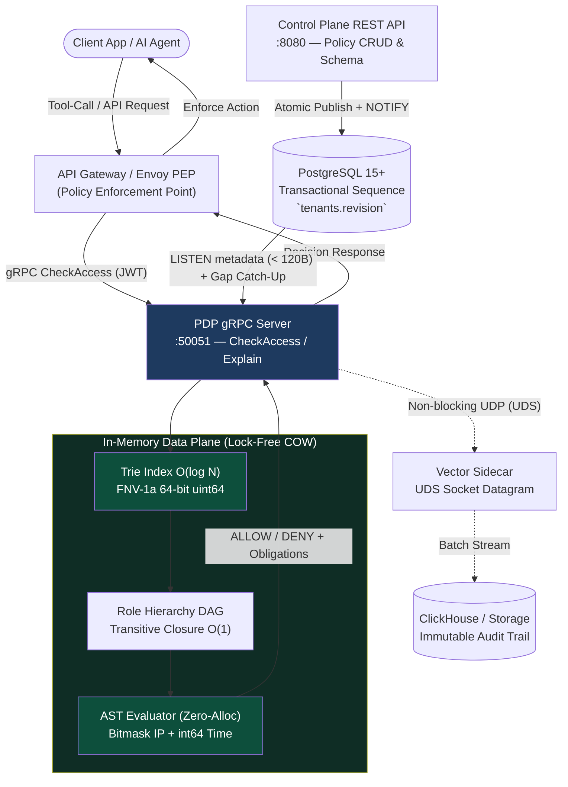

# Standalone Policy Engine (PDP)

[](https://github.com/Rochthii/standalone-policy-engine/actions/workflows/ci.yml)
[](https://go.dev)
[](./LICENSE)

An ultra-high-performance, in-memory **Policy Decision Point (PDP)** in Go implementing the PBAC/ABAC model with deterministic **AI Agent Guardrails & Obligations** (NIST AI RMF & OWASP LLM06). Designed for Cloud-Native microservices and multi-tenant SaaS requiring sub-microsecond access decisions and **Zero GC allocations** on the evaluation hot path.

---

## ⚡ Key Highlights & Benchmark Results

**Environment:** Intel Core i7-13700H (20 cores), Go 1.22+, Windows 11 / Linux

| Evaluation Scenario | Latency | Allocation | Throughput |
|---|---|---|---|
| **Concurrent Hot-Path Throughput** (`BenchmarkConcurrentLoad`) | **27.12 ns/op** | **0 B/op, 0 allocs/op** | **~36.8M RPS** |
| **10,000 Policies Load Contention** (`BenchmarkUltraExtreme_10kPolicies`) | **35.94 ns/op** | **0 B/op, 0 allocs/op** | **~27.8M RPS** |
| **Multi-Tenant ERP Access Control** (`BenchmarkERP_ConcurrentMultiTenant`) | **54.01 ns/op** | **0 B/op, 0 allocs/op** | **~18.5M RPS** |
| **AI Agent Guardrail & Obligations** (`BenchmarkAIAgent_GuardrailsLatency`) | **286.3 ns/op** | **0 B/op, 0 allocs/op** | **~3.49M RPS** |
| **Deep 11-Level DAG + 5,000 Decoy Policies** (`BenchmarkUltraExtreme_DeepDAG`) | **810.9 ns/op** | **0 B/op, 0 allocs/op** | **~1.23M RPS** |

---

## 🏗️ Architecture & Data Flow


```mermaid
flowchart TD
    Client(["Client App / AI Agent"])
    PEP["API Gateway / Envoy PEP\n(Policy Enforcement Point)"]
    CP["Control Plane REST API\n:8080 — Policy CRUD & Schema"]
    PDP["PDP gRPC Server\n:50051 — CheckAccess / Explain"]
    
    subgraph Engine ["In-Memory Data Plane (Lock-Free COW)"]
        Trie["Trie Index O(log N)\nFNV-1a 64-bit uint64"]
        DAG["Role Hierarchy DAG\nTransitive Closure O(1)"]
        AST["AST Evaluator (Zero-Alloc)\nBitmask IP + int64 Time"]
    end

    Postgres[("PostgreSQL 15+\nTransactional Sequence\n`tenants.revision`")]
    Vector["Vector Sidecar\nUDS Socket Datagram"]
    ClickHouse[("ClickHouse / Storage\nImmutable Audit Trail")]

    Client -->|"Tool-Call / API Request"| PEP
    PEP -->|"gRPC CheckAccess (JWT)"| PDP
    PDP --> Trie
    Trie --> DAG
    DAG --> AST
    AST -->|"ALLOW / DENY + Obligations"| PDP
    PDP -->|"Decision Response"| PEP
    PEP -->|"Enforce Action"| Client

    PDP -.->|"Non-blocking UDP (UDS)"| Vector
    Vector -.->|"Batch Stream"| ClickHouse

    CP -->|"Atomic Publish + NOTIFY"| Postgres
    Postgres -->|"LISTEN metadata (< 120B) + Gap Catch-Up"| PDP

    style PDP fill:#1e3a5f,color:#fff
    style Engine fill:#0f2d25,color:#fff
    style Trie fill:#0d4f3c,color:#fff
    style AST fill:#0d4f3c,color:#fff
```

### Core Architecture Invariants:
1. **Pure PostgreSQL Monotonic Sequence (Zero Redis, Zero 10s Polling):**
   - Policy updates increment `tenants.revision` atomically inside a transaction.
   - Metadata-only `NOTIFY policy_events` payload (< 120 bytes) respects the 8,000B PostgreSQL limit.
   - PDP detects missed revisions (`event.Revision > current + 1`) and triggers instant Fast Catch-Up (< 50ms).
2. **Autonomous AI Agent Guardrails (NIST / OWASP LLM06):**
   - Preserves binary `ALLOW` / `DENY` boolean evaluation.
   - Actions exceeding autonomous limits return `DENY` with pre-compiled runtime **Obligations** (`REQUIRE_HUMAN_APPROVAL`, `AUDIT_SENSITIVE_TOOL_CALL`, `MASK_ATTRIBUTES`).
3. **Zero Heap Allocations on Hot Path:**
   - Stack-allocated scratch buffers (`scratchNodes [64]`, `scratchIPs [64]`, `subScratch [32]`), `sync.Pool`, sentinel booleans, and bitwise IP network parsing.
4. **Lock-Free Read Operations:**
   - `CheckPermission` executes without Mutexes using atomic pointer swap (Copy-On-Write).
5. **Decoupled Zero-Alloc NDJSON Audit Streamer & Durability SLA:**
   - PDP streams Newline Delimited JSON (NDJSON) over Non-blocking Unix Domain Sockets (`unixgram`) in ~320ns with **Zero Heap Allocations**.
   - Durability, batching (10MB), on-disk buffering (5GB Persistent Volume), and retries are delegated to a dedicated Rust-based Vector sidecar.
   - Every audit record captures `rev` (`revision_id`) ensuring strict auditability for eventual consistency windows (Propagation Lag $\le 50\,\text{ms}$).

---

## 🚀 Quick Start

### 1. Run with Docker Compose
```bash
# Clone the repository
git clone https://github.com/Rochthii/standalone-policy-engine.git
cd standalone-policy-engine

# Start PostgreSQL 15, Vector sidecar, Control Plane, and PDP Server
docker compose -f tests/docker-compose.yml up --build -d
```

### 2. Run Locally from Source
```bash
# 1. Run Database Migrations
make migrate

# 2. Start Control Plane REST API (:8080)
go run cmd/control-plane/main.go

# 3. Start PDP Data Plane gRPC Server (:50051)
go run cmd/pdp-server/main.go

# 4. Use pectl CLI
go run cmd/pectl/main.go --help
```

---

## 📜 Declarative Policy Syntax (Cedar-like DSL)

Policies are written in a declarative syntax supporting RBAC, ABAC, and AI Guardrails:

```cedar
// 1. Autonomous AI Agent tool execution within budget
permit(
    principal in role:ai_agent,
    action    == action:EXECUTE,
    resource  == tool:erp_create_purchase_order
)
when {
    context.amount <= 2000 &&
    context.execution_mode == "autonomous_run"
};

// 2. High-value transactions trigger Human Approval obligation
forbid(
    principal in role:ai_agent,
    action    == action:EXECUTE,
    resource  == tool:erp_create_purchase_order
)
when {
    context.amount > 2000 &&
    context.execution_mode == "autonomous_run"
};

// 3. Separation of Duties (SoD) enforcement
forbid(
    principal == any,
    action    == action:APPROVE,
    resource  == doc:purchase_order
)
when {
    context.created_by != "" &&
    context.created_by == context.delegated_by
};
```

---

## 📁 Codebase Structure

```text
standalone-policy-engine/
├── .agents/                 # AI Master Context & 9 Domain Skills
├── cmd/
│   ├── pdp-server/          # gRPC Data Plane Server (:50051)
│   ├── control-plane/       # REST Control Plane API (:8080)
│   └── pectl/               # Enterprise Policy CLI
├── internal/
│   ├── engine/              # Trie Index, Role DAG, Zero-Alloc Evaluator, COW & Sync
│   ├── parser/              # Cedar DSL Lexer, Pratt Parser, Constant Folding
│   ├── server/              # gRPC Server, HTTP Handlers, Replay Buffer, JWT Auth
│   ├── audit/               # Async Ring Buffer Logger, UDS Vector socket, WORM encryption
│   ├── storage/             # PostgreSQL pgx driver, BadgerDB edge store
│   ├── config/              # Centralized type-safe configuration with fail-fast validation
│   └── security/            # JWT validation, Tenant isolation, AES-GCM envelope encryption
├── proto/v1/                # Protobuf Contract (CheckAccess, ExplainDecision, Obligations)
├── db/migrations/           # Versioned SQL migrations (golang-migrate)
└── tests/                   # E2E Docker Compose tests, Benchmarks, AI Guardrail tests
```

---

## 🛠️ CLI Tool (`pectl`)

`pectl` provides a CLI for managing policies, checking permissions, and running dry-run simulations:

```bash
# List policies for a tenant
pectl policy list tenant-123

# Create and publish a policy
pectl policy create tenant-123 --effect permit --file policy.cedar
pectl policy publish tenant-123 <policy-id>

# Check live access permission
pectl check tenant-123 --subject agent:financial_copilot --action EXECUTE --resource tool:erp_create_purchase_order

# Dry-run simulate a draft policy
pectl simulate tenant-123 --subject user:alice --action READ --resource file:report.pdf --draft-file draft.cedar
```

---

## 🧪 Verification & Benchmarking Commands

```bash
# 1. Run all unit tests
go test -v ./internal/...

# 2. Run Containerized E2E Integration Suite (Docker Compose)
go test -v -run=TestE2E_DockerComposeFlow ./tests

# 3. Run AI Agent Guardrail Verification & Benchmarks
go test -v -run=TestAIAgent -bench=BenchmarkAIAgent -benchmem ./tests

# 4. Run Complete Ultra-Extreme Benchmark Suite
go test -bench="." -benchmem -run="^$" ./tests
```

---

## 📄 License

MIT License — see [LICENSE](./LICENSE).