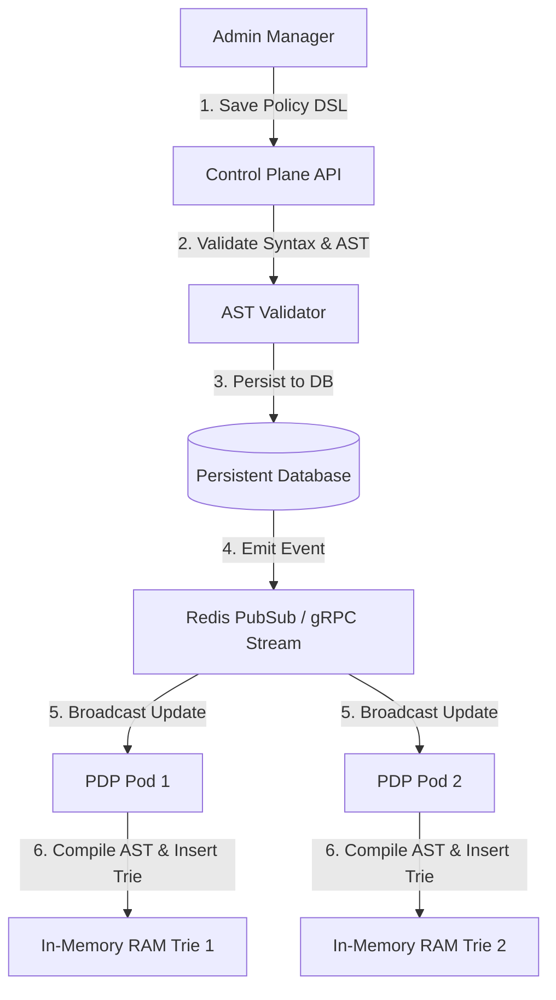
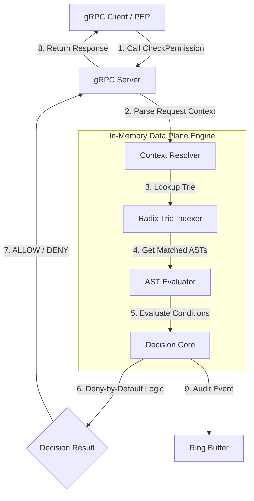
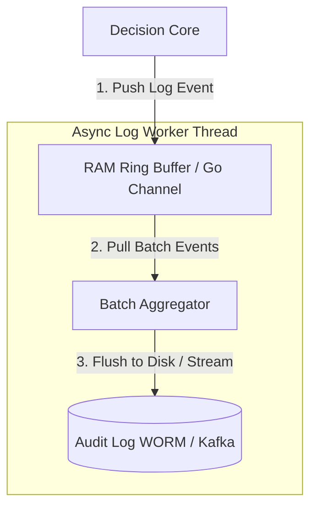

# Data Flow Specification

Tài liệu này đặc tả chi tiết dòng chảy dữ liệu (Data Flow) trong các kịch bản vận hành chính của **Standalone Policy Engine**.

---

## 1. Luồng nạp và Cập nhật Chính sách (Policy Load & Sync Flow)

1.  **Lưu trữ:** Quản trị viên gửi luật DSL mới sang Control Plane API.
2.  **Kiểm duyệt:** Cú pháp DSL được biên dịch thử thành AST. Nếu có lỗi, trả về lỗi ngay lập tức cho Admin, chặn đứng việc lưu trữ chính sách hỏng.
3.  **Lưu bền vững:** Chính sách hợp lệ được lưu vào Database bền vững.
4.  **Phát sự kiện:** Hệ thống phát sự kiện cập nhật chính sách sang kênh PubSub.
5.  **Cập nhật nóng:** Các node PDP nhận sự kiện, tự động tải chính sách mới từ DB, compile AST và hoán đổi con trỏ root của RAM Trie một cách an toàn mà không gián đoạn dịch vụ.

---

## 2. Luồng đánh giá Quyết định (Decision Flow)

1.  **Tiếp nhận:** gRPC Server tiếp nhận request chứa: `Subject`, `Action`, `Resource`, `Context Map`.
2.  **Phân tách:** Hệ thống trích xuất các thuộc tính động từ Context.
3.  **Tra cứu nhanh:** Radix Trie Indexer dựa vào `Subject` và `Resource` để lọc ra danh sách các chính sách có khả năng áp dụng (loại bỏ 99% các chính sách không liên quan).
4.  **Đánh giá:** AST Evaluator duyệt qua cây cú pháp của các chính sách được lọc, kiểm tra các điều kiện ABAC động.
5.  **Ra quyết định:** Áp dụng logic **Deny-by-Default**. Chỉ trả về `ALLOW` nếu có luật ALLOW khớp và không có bất kỳ luật DENY nào cản trở.
6.  **Ghi log nền:** Đẩy bản ghi log quyết định sang Ring Buffer để ghi log bất đồng bộ.

---

## 3. Luồng ghi Nhật ký Kiểm toán Bất đồng bộ (Async Audit Flow)

*   **Non-Blocking:** Luồng xử lý gRPC chính chỉ làm nhiệm vụ đẩy log event vào Go channel/Ring Buffer và trả kết quả ngay lập tức cho PEP.
*   **Batch Aggregator:** Worker chạy nền gom các sự kiện log lại theo nhóm (ví dụ: mỗi 100 logs hoặc sau mỗi 50ms) và thực hiện ghi hàng loạt (Bulk Write) xuống đĩa cứng hoặc đẩy sang Kafka, giảm thiểu tối đa chi phí I/O vật lý.
