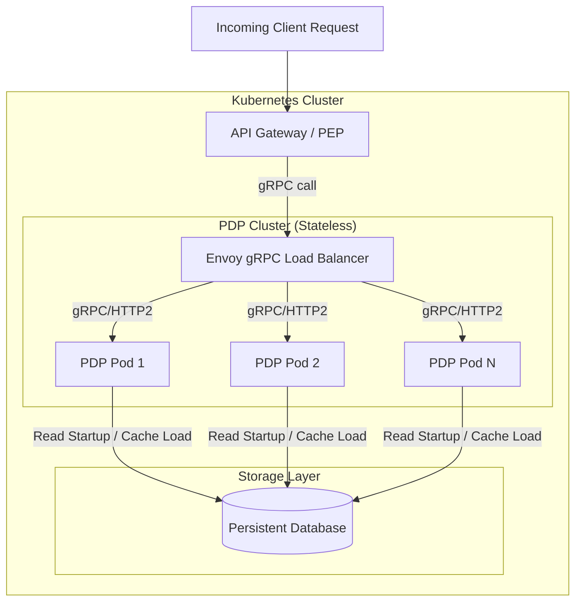

# Deployment Architecture Specification

Tài liệu này đặc tả các mô hình triển khai thực tế của **Standalone Policy Engine** trên hạ tầng Cloud-Native (Kubernetes, Docker), chiến lược mở rộng quy mô (Scaling) và cân bằng tải (Load Balancing).

---

## 1. Các Mô hình Triển khai (Deployment Topologies)

Policy Engine hỗ trợ hai cấu hình triển khai chính tùy thuộc vào quy mô hệ thống:

### Mô hình A: Centralized Shared Service (Khuyên dùng)
Hệ thống PDP chạy như một Cluster độc lập dùng chung cho toàn bộ Microservices.



*   **Ưu điểm:** Quản lý tập trung, tiết kiệm tài nguyên RAM (chỉ nạp cache trên cluster PDP), dễ dàng cập nhật phiên bản chính sách.
*   **Cân bằng tải gRPC:** Vì gRPC duy trì kết nối persistent HTTP/2 long-lived connection, cân bằng tải L4 thông thường sẽ làm lệch tải. Ta bắt buộc phải sử dụng **Envoy Proxy** hoặc K8s service mesh (Linkerd/Istio) để thực hiện cân bằng tải cấp **L7 (gRPC request-level load balancing)**.

### Mô hình B: Local Sidecar Daemon
PDP Pod chạy như một container phụ (Sidecar) nằm ngay trong Pod của Microservice (PEP).

*   **Đặc điểm:** PEP gọi sang PDP qua cổng `localhost:50051`.
*   **Ưu điểm:** Triệt tiêu hoàn toàn độ trễ mạng (Network Latency), đảm bảo độ trễ phân quyền đạt mức tối thiểu tuyệt đối (`< 0.1ms`).
*   **Nhược điểm:** Tốn tài nguyên RAM vì mỗi Microservice Pod đều phải chạy một cache chính sách riêng, khó đồng bộ trạng thái cache đồng loạt hơn.

---

## 2. Chiến lược Mở rộng Quy mô (Horizontal Auto-Scaling)

*   **Stateless Engine Nodes:** Vì các node PDP phục vụ kiểm tra quyền chạy hoàn toàn trên RAM và không lưu trạng thái ghi (Read-Only Data Plane), ta có thể nhân bản (Scale-out) chúng không giới hạn.
*   **Cấu hình HPA (Horizontal Pod Autoscaler):**
    *   Hệ thống PDP sử dụng nhiều CPU cho việc đánh giá AST biểu thức logic. Ta cấu hình HPA tự động scale dựa trên mức độ sử dụng CPU:
    ```yaml
    minReplicas: 3
    maxReplicas: 30
    metrics:
    - type: Resource
      resource:
        name: cpu
        target:
          type: Utilization
          averageUtilization: 70
    ```
    *   Thiết lập `minReplicas: 3` trải rộng trên 3 Availability Zones (AZs) khác nhau để đảm bảo khả năng chịu lỗi tối đa (High Availability).
