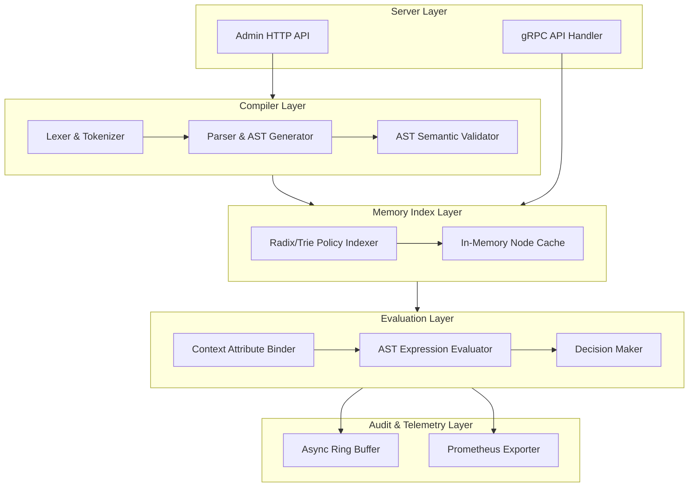

# Logical Architecture Specification

Tài liệu này đặc tả chi tiết cấu trúc logic, các module phần mềm nội bộ của **Standalone Policy Engine** và sự phân tách trách nhiệm giữa chúng.

---

## 1. Sơ đồ Cấu trúc Logic nội bộ (Internal Module Design)

---

## 2. Chi tiết chức năng từng Phân lớp (Module Details)

### A. Server Layer
*   **gRPC Handler:** Điểm tiếp nhận request phân quyền từ API Gateway. Sử dụng Protobuf v3 giúp giảm dung lượng payload truyền tải trên mạng.
*   **Admin HTTP API:** Điểm tiếp nhận cấu hình, nạp tệp quy tắc phân quyền mới của quản trị viên dưới dạng file cấu hình DSL.

### B. Compiler Layer
*   **Lexer & Tokenizer:** Phân tích chuỗi text DSL chính sách thành các token cú pháp.
*   **Parser & AST Generator:** Dựng cây cú pháp logic AST dựa trên token. Ví dụ, biểu thức `context.ip in "192.168.1.0/24"` sẽ được parse thành một node biểu thức so sánh.
*   **AST Semantic Validator:** Kiểm tra lỗi ngữ nghĩa, phát hiện các logic đệ quy nguy hiểm (Loop) hoặc mâu thuẫn luật (ví dụ: Vừa ALLOW vừa DENY cùng một đối tượng mà không có luật ưu tiên).

### C. Memory Index Layer
*   **Radix/Trie Policy Indexer:** Bản đồ chỉ mục phân quyền. Bản đồ này nhóm các chính sách lại theo cấu trúc cây có tiền tố. Khi có request cho `user:alice` truy cập `file:document.pdf`, indexer chỉ truy xuất các node liên quan đến `user:alice` hoặc nhóm của Alice, loại bỏ việc duyệt tuyến tính qua toàn bộ database.
*   **In-Memory Node Cache:** Lưu trữ trực tiếp các struct AST đã được compile, sẵn sàng cho việc đánh giá mà không cần parse lại.

### D. Evaluation Layer
*   **Context Attribute Binder:** Ánh xạ các biến động từ request context của API Gateway vào trong AST evaluator.
*   **AST Expression Evaluator:** Chạy thuật toán duyệt cây AST để đánh giá các biểu thức boolean động của ABAC.
*   **Decision Core:** Tổng hợp kết quả đánh giá (Đặc biệt tuân thủ nguyên tắc **Deny-by-Default**: Nếu không có luật ALLOW nào khớp, hoặc có bất kỳ luật DENY nào khớp, kết quả sẽ là DENY).

### E. Audit & Telemetry Layer
*   **Async Ring Buffer:** Hàng đợi vòng tròn trên RAM nhận log quyết định bất đồng bộ, tránh chặn luồng trả phản hồi gRPC về cho API Gateway.
*   **Prometheus Exporter:** Thu thập và cung cấp các thông số hiệu năng (RPS, Latency distribution) thời gian thực.
