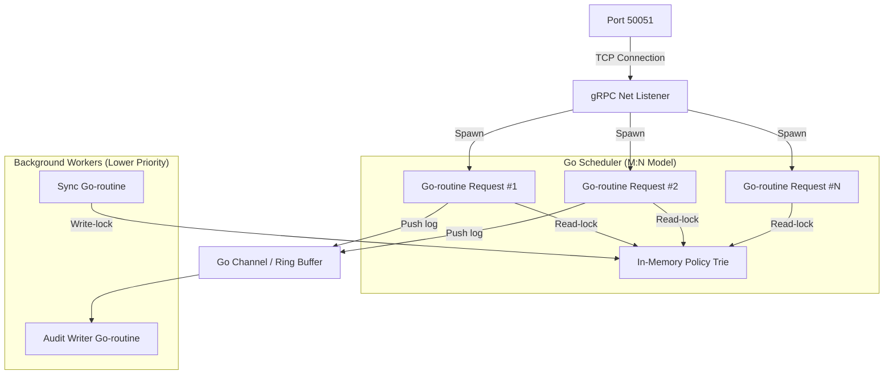

# Physical Architecture Specification

Tài liệu này đặc tả cách phân bổ tài nguyên vật lý, kiến trúc quản lý luồng trong Go (Concurrency) và mô hình khóa bảo vệ bộ nhớ của **Standalone Policy Engine**.

---

## 1. Phân bổ luồng xử lý trên CPU (Go-routine Concurrency Model)

Để tận dụng tối đa kiến trúc đa nhân của CPU và duy trì độ trễ cực thấp, Policy Engine tổ chức các luồng như sau:

*   **Request-Handling Go-routines:** Mỗi request gRPC gửi tới sẽ được Go Runtime lập lịch chạy trên một Go-routine riêng biệt. Go Scheduler tự động ánh xạ các Go-routine này lên các luồng vật lý (OS Threads) thông qua mô hình M:N.
*   **Background Workers:** Các Go-routine chạy nền đảm nhận hai vai trò:
    1.  Đồng bộ hóa trạng thái (Sync Go-routine): Chờ tín hiệu cập nhật chính sách từ DB để ghi đè RAM cache.
    2.  Ghi nhật ký (Audit Go-routine): Đọc dữ liệu từ Ring Buffer/Channel để lưu xuống đĩa cứng một cách bất đồng bộ.

---

## 2. Thiết kế Khóa truy cập Bộ nhớ (Lock Design)

Vì hàng chục nghìn Go-routines cùng đọc dữ liệu trên cây Trie chính sách trong RAM, việc thiết kế khóa (Lock) là yếu tố quyết định hiệu năng:

*   **Sử dụng `sync.RWMutex`:** 
    *   Hầu hết các request chỉ thực hiện thao tác **Đọc** (`RLock()`). Nhiều Go-routines có thể đọc đồng thời mà không bị block lẫn nhau.
    *   Thao tác **Ghi** (`Lock()`) chỉ xảy ra khi Admin cập nhật chính sách mới (tần suất cực thấp, ví dụ vài lần mỗi ngày). Khi có thao tác ghi, toàn bộ luồng đọc sẽ bị chặn tạm thời trong vài micro giây để cập nhật cây AST mới.
*   **Cơ chế Copy-On-Write (COW) cho AST:**
    *   Thay vì lock và sửa trực tiếp trên cây Trie đang chạy, Engine biên dịch cây Trie mới trên một vùng nhớ tạm.
    *   Sau khi hoàn tất, ta chỉ thực hiện hoán đổi con trỏ gốc (Root Pointer Swap) dưới một khóa ghi (`Lock()`) cực ngắn. Cơ chế này giảm thời gian giữ khóa ghi xuống mức tối thiểu (nano-giây), triệt tiêu hiện tượng nghẽn luồng đọc (Lock Contention).
*   **sync.Pool cho Parser & AST Nodes:**
    *   Để tránh chi phí dọn rác của Garbage Collector (GC pause) khi sinh hàng triệu AST node tạm thời, Engine sử dụng `sync.Pool` để tái sử dụng các vùng nhớ đã cấp phát cho quá trình Parse và Bind context.
