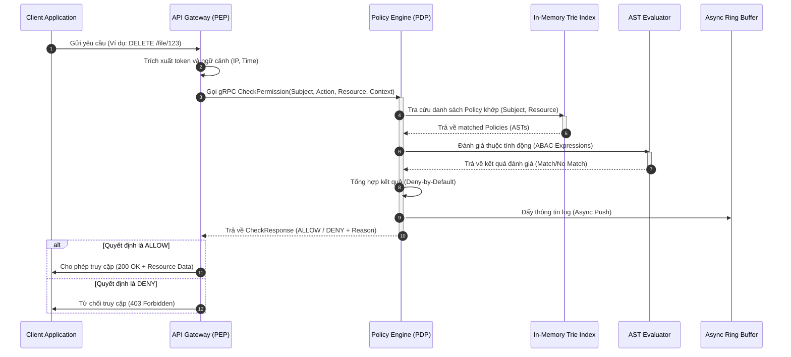
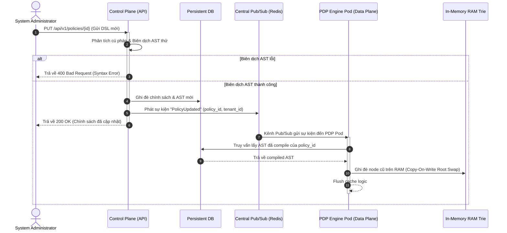

# Sequence Diagrams Specification

Tài liệu này cung cấp các sơ đồ tuần tự (Sequence Diagrams) mô tả tương tác động giữa các thành phần trong **Standalone Policy Engine**.

---

## 1. Sơ đồ Tuần tự: Yêu cầu Kiểm tra Quyền (gRPC Evaluation Sequence)

Sơ đồ này mô tả chi tiết từ lúc client yêu cầu truy cập tài nguyên cho đến khi PDP đưa ra quyết định phân quyền:

---

## 2. Sơ đồ Tuần tự: Đồng bộ hóa Chính sách (Policy Sync Sequence)

Sơ đồ này mô tả quá trình cập nhật nóng chính sách lên RAM cache của các node PDP khi Admin thay đổi:

