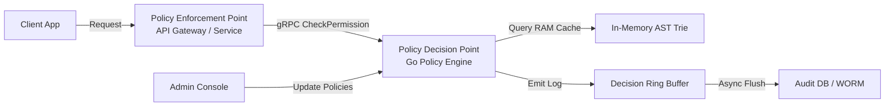
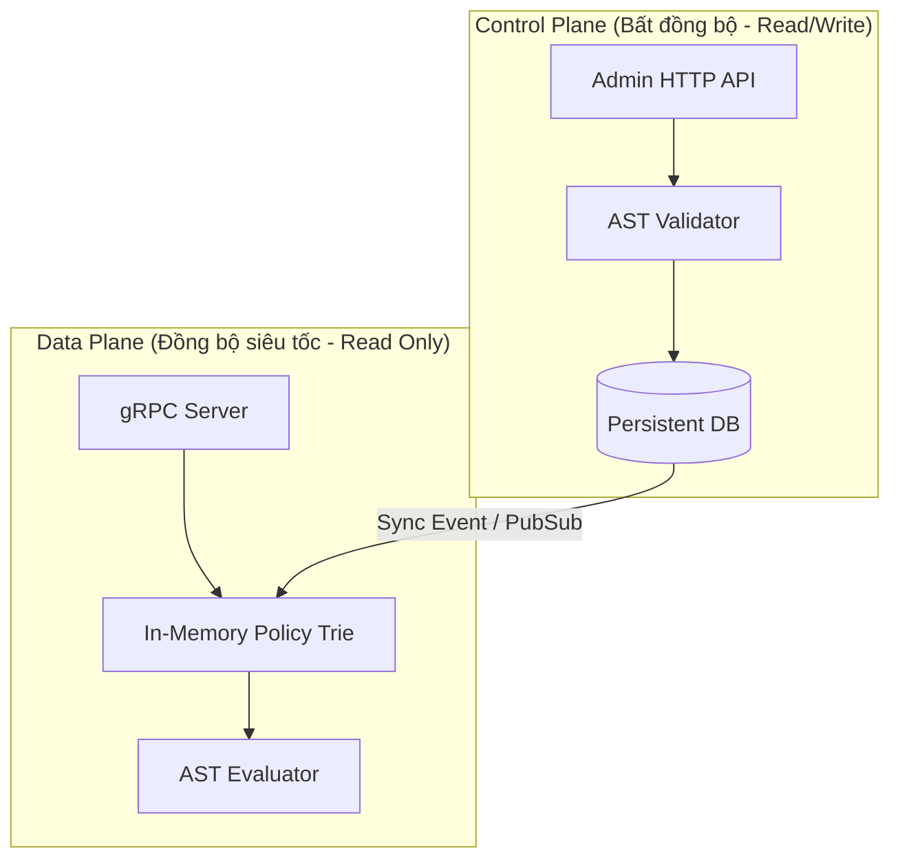

# System Architecture Overview

Tài liệu này cung cấp bức tranh tổng quan về kiến trúc hệ thống của **Standalone Policy Engine**, các thành phần tham gia và ranh giới tương tác của chúng.

---

## 1. Mô hình Tương tác PEP-PDP

Hệ thống hoạt động theo mô hình kiểm soát truy cập phân tán chuẩn hóa của NIST:

*   **PEP (Policy Enforcement Point):** Nằm tại API Gateway hoặc các microservices biên. Khi có request từ client, PEP chặn lại và gửi thông tin ngữ cảnh sang PDP qua gRPC để xin quyết định. PEP chịu trách nhiệm thi hành quyết định (Cho phép hoặc Chặn 403).
*   **PDP (Policy Decision Point):** Trái tim của hệ thống. Nhận yêu cầu từ PEP, tìm kiếm luật thích hợp trên RAM và chạy bộ đánh giá AST để trả về ALLOW/DENY.

---

## 2. Phân rã hai phân lớp (Control Plane & Data Plane)

Để đảm bảo hiệu năng tối đa và tính ổn định cao, hệ thống tách biệt hoàn toàn luồng xử lý:

### Control Plane:
*   **Nhiệm vụ:** Tiếp nhận các tệp cấu hình quy tắc phân quyền mới từ người quản trị hệ thống, thực hiện biên dịch thử cú pháp (compile AST) và lưu vào cơ sở dữ liệu bền vững (Persistent Storage).
*   **Tính chất:** Chấp nhận độ trễ (Latency ở mức giây), tần suất gọi thấp.

### Data Plane:
*   **Nhiệm vụ:** Trả lời trực tiếp các câu hỏi *"Ai được quyền làm gì"* từ PEP.
*   **Tính chất:** Yêu cầu độ trễ cực thấp (<1ms), phi trạng thái (Stateless), chạy hoàn toàn trên RAM cache, tần suất gọi cực cao (hàng chục nghìn lần/giây).
*   **Cập nhật nóng:** Khi Control Plane cập nhật cơ sở dữ liệu, một sự kiện Pub/Sub sẽ được gửi sang Data Plane để dọn cache và nạp lại cấu trúc Trie trên RAM của các node Data Plane mà không cần khởi động lại dịch vụ.
