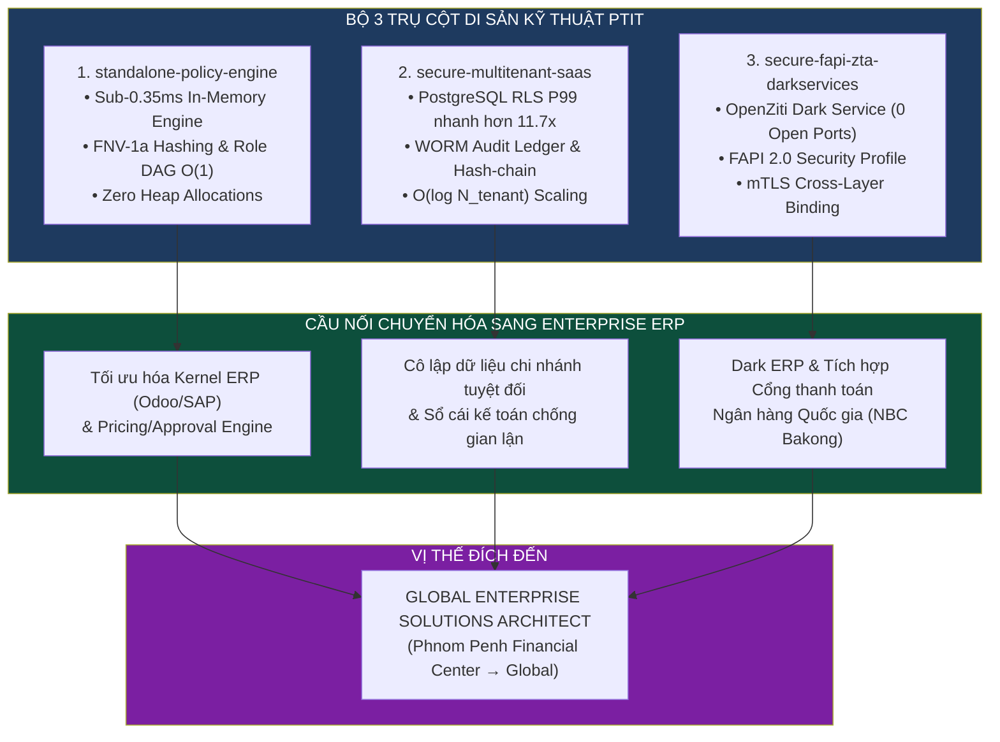

# LỘ TRÌNH CHIẾN LƯỢC: TỪ KỸ SƯ PHẦN MỀM BẢO MẬT (PTIT) ĐẾN CHUYÊN GIA GIẢI PHÁP ERP QUỐC TẾ

> **Tầm nhìn:** Định hình vị thế Enterprise Solutions Architect dẫn đầu thị trường Quốc tế (Phnom Penh / Đông Nam Á / Global)  
> **Nền tảng:** Chương trình Chất lượng cao Kỹ thuật Phần mềm — Học viện Công nghệ Bưu chính Viễn thông (PTIT)  
> **Bộ 3 Trụ Cột Kỹ Thuật:** `standalone-policy-engine` ⨁ `secure-multitenant-saas` ⨁ `secure-fapi-zta-darkservices`

---

## 🏛️ PHẦN 1. PHÂN TÍCH TẦM NHÌN VÀ VỊ THẾ CHIẾN LƯỢC

Trong một thị trường nhân sự đang dần bão hòa, sự kết hợp giữa tư duy **Kỹ thuật Phần mềm (Software Engineering)** và **Bảo mật hệ thống chuyên sâu (Deep Systems Security)** không chỉ là một lợi thế — đó là **"Competitive Moat" (Hào bảo vệ cạnh tranh)** độc nhất giúp bạn tách biệt hoàn toàn với nhóm kỹ thuật viên chỉ biết cấu hình nghiệp vụ thông thường.

Đối với một Chuyên gia Giải pháp ERP quốc tế, khả năng **tái cấu trúc kernel hệ thống để đạt mức bảo mật và hiệu năng cấp ngân hàng** chính là tấm vé bước vào các tập đoàn đa quốc gia và hệ thống tài chính tại các thị trường năng động như Campuchia (Trung tâm tài chính Phnom Penh, hệ thống thanh toán quốc gia **NBC Bakong**).



### Đối Chiếu Chuẩn Đầu Ra Kỹ Sư CLC PTIT (LO1 — LO10):
* **Năng lực thiết kế thực nghiệm (LO5):** Khả năng A/B testing hiệu năng ERP dưới tải trọng cực lớn ($> 1.000.000$ RPS), đảm bảo hệ thống không sụp đổ khi xử lý hàng triệu bản ghi.
* **Tư duy hệ thống và mô hình hóa (LO4, LO7):** Chuyển đổi các bài toán kinh tế, dòng tiền P2P/O2C và kế toán kép (LO6) thành các tiến trình kỹ thuật tối ưu.
* **Sự giao thoa kỹ thuật — bảo mật (LO2, LO3):** Am hiểu sâu sắc về kiến trúc máy tính và an toàn mạng để xây dựng giải pháp phòng thủ đa tầng (*Defense-in-depth*).
* **Thích ứng toàn cầu (LO9, LO10):** Chuyển đổi linh hoạt từ lý thuyết academic sang ứng dụng thực tế với năng lực tiếng Anh chuyên môn thành thạo (IELTS 6.5+).

---

## ⚙️ PHẦN 2. DI SẢN KỸ THUẬT: MAPPING 3 TRỤ CỘT PROJECT SANG HỆ THỐNG ERP

| Dự án nguồn tại PTIT | Di sản kỹ thuật cốt lõi | Ứng dụng kiến trúc vào ERP (Solution Architect) |
|---|---|---|
| **`standalone-policy-engine`** | • PBAC/ABAC, Trie lookup FNV-1a 64-bit.<br>• String Interning & Role DAG Closure.<br>• Zero Heap Allocation on Hot-path. | • Thiết kế Engine tính giá (Pricing Engine) phức tạp.<br>• Luồng phê duyệt đa tầng thời gian thực $< 0.35$ms.<br>• Chốt chặn tiền định ngăn AI Agent vượt quyền. |
| **`secure-multitenant-saas`** | • PostgreSQL Row-Level Security (RLS).<br>• WORM Audit Ledger & Hash-chaining.<br>• $O(\log N_{\text{tenant}})$ B-Tree Index Scaling. | • Cô lập dữ liệu tuyệt đối giữa các chi nhánh tập đoàn.<br>• Chống gian lận sổ cái tài chính theo ISO/IEC 27017.<br>• P99 nhanh hơn truy vấn JOIN truyền thống 11.7 lần. |
| **`secure-fapi-zta-darkservices`** | • FAPI 2.0 Security Profile.<br>• OpenZiti Zero Open Ports (Dark Service).<br>• mTLS & Cross-Layer Binding. | • Tích hợp API ngân hàng & Gateway (NBC Bakong).<br>• Xây dựng **"Dark ERP"** hoàn toàn vô hình trước các cuộc tấn công quét cổng trên Internet. |

---

## 🔄 PHẦN 3. CHUYỂN ĐỔI TECHNICAL STACK: TỪ GO/NEXT.JS SANG ODOO & SAP

* **Từ Go sang Python (Odoo 17):** Tư duy *"Zero Allocation"* và tối ưu hóa bộ nhớ trong Go giúp bạn viết các Odoo Custom Addons cực kỳ tinh gọn. Ứng dụng **OpenZiti** biến Odoo Deployment thành một hệ thống vô hình trước mạng internet công cộng.
* **Từ C++/Java sang ABAP & CAP (SAP S/4HANA):** Nền tảng lập trình hướng đối tượng vững chắc tại PTIT là bàn đạp làm chủ SAP ABAP. Tư duy hệ thống phân tán được chuyển hóa thành khả năng tối ưu hóa **SAP HANA In-Memory Database**.
* **Tái cấu trúc Business Rules:** Thay vì dùng các vòng lặp nested loop chậm chạp trong ERP, bạn triển khai các bộ lọc logic trong RAM (Trie/DAG) từ `standalone-policy-engine` để đạt hiệu năng xử lý hằng số $O(1)$.

---

## 🤖 PHẦN 4. PHƯƠNG PHÁP "CONTROLLED VIBE CODING" & QUẢN TRỊ TRI THỨC

Trong kỷ nguyên AI, **AI là trợ thủ gia tăng năng suất 10x nhưng Kiến trúc sư phải là người cầm lái tuyệt đối (*Absolute Grounding*)**:
1. **Kiểm soát bằng Source Context:** Tuyệt đối không để AI tự quyết định cấu trúc bảo mật. Bạn áp dụng mTLS, DPoP và WORM Ledger dựa trên kiến thức mật mã học đã thực hiện.
2. **Reverse Engineering bằng Code Graph:** Sử dụng AI để bóc tách luồng dữ liệu của các module ERP phức tạp hàng chục nghìn dòng code.
3. **Architect-First, AI-Second:** Thiết kế bộ khung cấu trúc bảng dữ liệu và luồng kiểm soát quyền trước; AI chỉ làm nhiệm vụ sinh mã boilerplate.

---

## 🗺️ PHẦN 5. LỘ TRÌNH HÀNH ĐỘNG 4 GIAI ĐOẠN (ROADMAP TO CAMBODIA & GLOBAL)

```text
┌─────────────────────────────────────────────────────────────────────────────┐
│  GIAI ĐOẠN 1 (NĂM 3 PTIT - HIỆN TẠI): CỦNG CỐ DI SẢN KỸ THUẬT               │
│  • Hoàn thiện 3 dự án core với tài liệu kỹ thuật chuẩn quốc tế.             │
│  • Đạt chứng chỉ tiếng Anh IELTS 6.5+ (tận dụng chương trình CLC).          │
│  • Thực hành sâu Database Internals & 4 chu trình kinh tế (P2P, O2C).       │
├─────────────────────────────────────────────────────────────────────────────┤
│  GIAI ĐOẠN 2 (NĂM 4 - THỰC TẬP & TỐT NGHIỆP): CHUYÊN NGHIỆP HÓA DOANH NGHIỆP│
│  • Thực tập tại các Vendor ERP (FPT, Viettel, Big 4, Odoo/SAP Partners).    │
│  • Lấy chứng chỉ chính thức: SAP Certified Associate / openSAP Records.     │
│  • Bảo vệ Đồ án tốt nghiệp: Đạt 9.5-10 với Live Demo PDP 1M+ RPS & Guardrail│
├─────────────────────────────────────────────────────────────────────────────┤
│  GIAI ĐOẠN 3 (RA TRƯỜNG: THỊ TRƯỜNG PHNOM PENH & REGIONAL): BỨT PHÁ THỰC ĐỊA│
│  • Gia nhập các tập đoàn đa quốc gia, ngân hàng hoặc Fintech tại Phnom Penh.│
│  • Tích hợp ERP với hệ thống thanh toán quốc gia Bakong (NBC) qua FAPI 2.0. │
│  • Triển khai "Dark ERP" an toàn tuyệt đối cho các tổ chức tài chính lớn.   │
├─────────────────────────────────────────────────────────────────────────────┤
│  GIAI ĐOẠN 4 (3-5 NĂM: GLOBAL SOLUTIONS ARCHITECT): KHẲNG ĐỊNH VỊ THẾ       │
│  • Chuyên gia tư vấn cấp cao về kiến trúc ERP Multi-Tenant toàn cầu.        │
│  • Nắm giữ mức thu nhập Top 5% ngành CNTT trong khu vực.                    │
└─────────────────────────────────────────────────────────────────────────────┘
```

---

## 📋 CHECKLIST HÀNH ĐỘNG 30 NGÀY TỚI

1. [ ] **Mapping Nghiệp Vụ:** Lấy 5 bảng dữ liệu chính trong Odoo Accounting (`account_move`, `account_move_line`, `purchase_order`, `res_partner`, `res_company`) mapping trực tiếp vào cấu trúc RLS trong dự án SaaS.
2. [ ] **Thực Hành Lab Odoo 17:** Khởi chạy `E:\Projects\ERP_Mastery_Hub\01_Odoo_Lab\docker-compose.yml`, kiểm thử module gọi sang Go PDP Engine.
3. [ ] **Đăng Ký openSAP & SAP Learning:** Hoàn thành khóa học *"Discovering SAP S/4HANA"* và *"Building Side-by-Side Extensions on SAP BTP"*.
4. [ ] **Thuyết Trình Kỹ Thuật (English Demo):** Quay video ngắn 5 phút demo bằng tiếng Anh giải thích về Latency Budget và Benchmark 1M+ RPS của Policy Engine.
