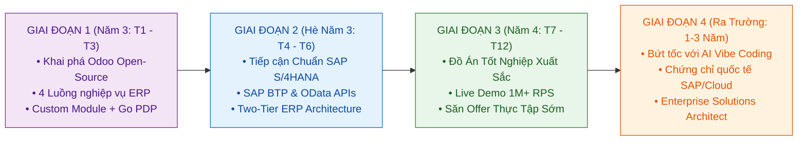

# Lộ Trình Căn Tính: Kỹ Thuật Phần Mềm & Kiến Trúc ERP (SAP & Odoo) Kỷ Nguyên AI

> **Định hướng chiến lược:** Bản thiết kế lộ trình phát triển duy nhất dành cho sinh viên Kỹ thuật Phần mềm (SE) có mục tiêu làm chủ hệ sinh thái ERP (SAP & Odoo), tận dụng sức mạnh AI Vibe Coding từ Năm 3 đến vị trí **Enterprise Solutions Architect**.

---

## 🎯 1. Bản Thể Luận & Căn Tính Cốt Lõi (First Principles)

Lộ trình này được xây dựng dựa trên sự giao thoa của **3 trụ cột căn tính không thể thay thế**:

```text
┌─────────────────────────────────────────────────────────────────────────────┐
│                      3 TRỤ CỘT CĂN TÍNH TRONG KỶ NGUYÊN AI                  │
├─────────────────────────────────────────────────────────────────────────────┤
│  1. CĂN TÍNH KINH TẾ (ERP Domain Truth):                                    │
│     • Hiểu thấu đáo cách tiền, tài sản, kho hàng và báo cáo tài chính vận   │
│       hành trong thế giới thực. AI không thể tự bịa ra luật thuế hay SoD.    │
│                                                                             │
│  2. CĂN TÍNH KỸ THUẬT (Software Engineering Rigor):                         │
│     • Kiến trúc hệ thống phân tán, giao thức mạng (gRPC/OData), ACID,       │
│       bộ nhớ in-memory, con trỏ nguyên tử, và kiểm chứng đo lường định lượng│
│                                                                             │
│  3. CĂN TÍNH THỜI ĐẠI (AI Agentic Orchestration):                           │
│     • Bạn là Kiến trúc sư trưởng đưa ra đặc tả và luật lệ; AI là trợ lý     │
│       lập trình thực thi với tốc độ gấp 10 lần.                             │
└─────────────────────────────────────────────────────────────────────────────┘
```

---

## 🗺️ 2. Sơ Đồ Tổng Quan 4 Giai Đoạn



---

## 📑 3. Bản Đồ Tài Liệu Chi Tiết

Mỗi giai đoạn được đặc tả chi tiết trong một file tài liệu độc lập với đầy đủ: **Mục tiêu $\rightarrow$ Cần học gì $\rightarrow$ Cần làm gì $\rightarrow$ Sản phẩm đầu ra $\rightarrow$ Bộ câu hỏi phỏng vấn**:

| STT | Tài liệu chi tiết | Trọng tâm giai đoạn | Sản phẩm bàn giao cốt lõi |
|---|---|---|---|
| 01 | [**`01_PHASE_1_ODOO_FOUNDATION.md`**](file:///e:/Projects/Project_TN/standalone-policy-engine/docs/career-roadmap/01_PHASE_1_ODOO_FOUNDATION.md) | Làm chủ Odoo, PostgreSQL và tích hợp Go PDP | Module Odoo tùy biến kết nối gRPC PDP |
| 02 | [**`02_PHASE_2_SAP_ENTERPRISE.md`**](file:///e:/Projects/Project_TN/standalone-policy-engine/docs/career-roadmap/02_PHASE_2_SAP_ENTERPRISE.md) | Tiếp cận chuẩn mực tập đoàn SAP S/4HANA & BTP | Mô hình tích hợp Two-Tier ERP Odoo $\leftrightarrow$ SAP |
| 03 | [**`03_PHASE_3_CAPSTONE_INTERNSHIP.md`**](file:///e:/Projects/Project_TN/standalone-policy-engine/docs/career-roadmap/03_PHASE_3_CAPSTONE_INTERNSHIP.md) | Đồ án tốt nghiệp xuất sắc & Săn việc làm | Thuyết minh đồ án 100 trang + Offer thực tập |
| 04 | [**`04_PHASE_4_ENTERPRISE_ARCHITECT.md`**](file:///e:/Projects/Project_TN/standalone-policy-engine/docs/career-roadmap/04_PHASE_4_ENTERPRISE_ARCHITECT.md) | Nâng tầm thành Kiến trúc sư giải pháp doanh nghiệp | Lộ trình thăng tiến Senior/Lead Architect |

---

## ⚖️ 4. Bảng So Sánh Chiến Lược: Odoo vs SAP Trong Sự Nghiệp

```text
┌─────────────────────────┬───────────────────────────────┬───────────────────────────────┐
│ TIÊU CHÍ                │ HỆ SINH THÁI ODOO             │ HỆ SINH THÁI SAP              │
├─────────────────────────┼───────────────────────────────┼───────────────────────────────┤
│ Phân khúc khách hàng    │ Doanh nghiệp vừa & nhỏ (SME)  │ Tập đoàn tỷ USD, Đa quốc gia  │
│ Mã nguồn & Khả năng học │ 100% Open-Source (Python/PG)  │ Enterprise Cloud (SAP BTP)    │
│ Vai trò của bạn         │ Nắm bản chất ruột gan code    │ Định hình kiến trúc tập đoàn  │
│ Độ linh hoạt tùy biến   │ Cực kỳ nhanh và linh hoạt     │ Tuân thủ chặt chẽ Clean Core  │
│ Mức thu nhập thị trường │ Khá - Cao ($800 - $2,500)     │ Rất cao ($1,500 - $5,000+)    │
└─────────────────────────┴───────────────────────────────┴───────────────────────────────┘
```

👉 **Giá trị độc nhất của bạn:** Khi kết hợp cả **Odoo (Hiểu sâu code)** + **SAP (Nắm chuẩn tập đoàn)** + **Engine phân quyền Go hiệu năng cao**, bạn trở thành nhân sự hiếm hoi có khả năng thiết kế và tích hợp các hệ thống **Two-Tier ERP** phức tạp nhất thị trường.
