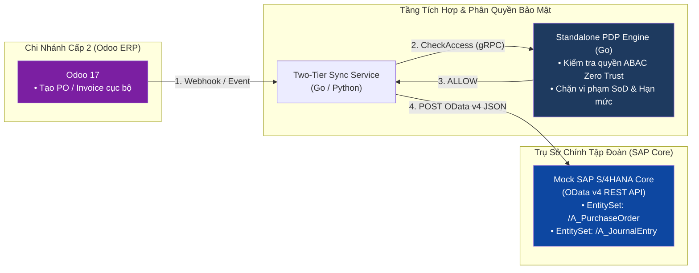

# Giai Đoạn 2: Tiếp Cận Chuẩn Mực Doanh Nghiệp Tỷ USD Với SAP
> **Thời gian:** Hè Năm 3 (Tháng 4 — Tháng 6) | **Mục tiêu:** Nắm vững chuẩn mực quy trình SAP S/4HANA, SAP BTP & Kiến trúc Two-Tier ERP

---

## 🎯 1. Mục Tiêu Cốt Lõi (Learning Objectives)

1. Hiểu cấu trúc tổ chức doanh nghiệp chuẩn quốc tế của SAP (Enterprise Structure).
2. Nắm vững triết lý phát triển hiện đại của SAP: **SAP Clean Core**, **SAP BTP (Business Technology Platform)** và **OData v2/v4 Services**.
3. Xây dựng mô hình tích hợp **Two-Tier ERP**: Chi nhánh dùng **Odoo**, Trụ sở chính dùng **SAP S/4HANA (Mock OData API)** với chốt chặn phân quyền bằng **Standalone PDP**.

---

## 📚 2. Cần Học Những Gì? (Kiến Thức & Tài Liệu Chuẩn)

### A. Cấu Trúc Doanh Nghiệp Trong SAP (SAP Enterprise Structure)
```text
Client (Tập đoàn)
  └── Company Code (BUKRS - Pháp nhân độc lập có Báo cáo tài chính riêng)
        ├── Plant (WERKS - Nhà máy / Chi nhánh / Trung tâm phân phối)
        │     └── Storage Location (LGORT - Kho vật lý)
        ├── Purchasing Organization (Tổ chức Mua hàng)
        ├── Sales Organization (Tổ chức Bán hàng)
        └── Controlling Area (Trung tâm Chi phí - Cost Center / Profit Center)
```

### B. Công Nghệ SAP Hiện Đại (Bỏ Qua Màn Hình Đen Trắng Cũ Kỹ)
1. **SAP Clean Core:** Nguyên tắc không sửa đổi trực tiếp vào code core của SAP, mà phát triển các ứng dụng mở rộng (Side-by-Side Extensions) trên **SAP BTP**.
2. **SAP OData Services:** Giao thức RESTful tiêu chuẩn của SAP dựa trên chuẩn OASIS (hỗ trợ các thao tác CRUD `$filter`, `$expand`, `$select` dạng JSON/XML).
3. **SAP Authorization & Security:**
   - Authorization Objects (ví dụ: `M_BEST_EKO` - Mua hàng theo Purchasing Org, `F_BKPF_BUK` - Kế toán theo Company Code).
   - **SAP GRC Access Control:** Ma trận kiểm soát phân tách trách nhiệm (Separation of Duties - SoD).

### C. Nguồn Học & Chứng Chỉ Miễn Phí Chính Hãng:
- **SAP Learning:** [learning.sap.com](https://learning.sap.com/) — Lộ trình: *Discovering SAP S/4HANA*, *Exploring SAP BTP*.
- **openSAP:** Tham gia các khóa MOOC chính thức của SAP để nhận chứng chỉ hoàn thành (Record of Achievement).
- **SAP Developer Tutorials:** [developers.sap.com/tutorials.html](https://developers.sap.com/tutorials.html).

---

## 🛠️ 3. Cần Làm Những Gì? (Checklist Thực Chiến Từng Tuần)

### Tuần 1–4: Học & Lấy Chứng Chỉ Cơ Bản Từ SAP
- [ ] Đăng ký tài khoản miễn phí trên `learning.sap.com` và `developers.sap.com`.
- [ ] Hoàn thành khóa học: **"Discovering SAP S/4HANA"** (Hiểu cặn kẽ thuật ngữ FI/CO, MM, SD).
- [ ] Hoàn thành khóa học: **"Building Side-by-Side Extensions on SAP BTP"**. Lấy ít nhất 1 chứng chỉ hoàn thành.

### Tuần 5–8: Xây Dựng Dự Án Tích Hợp "Two-Tier ERP Bridge"


- [ ] Dùng AI viết một Mock SAP S/4HANA OData Server bằng Go (hoặc FastAPI):
  - Expose endpoint chuẩn: `POST /sap/opu/odata/sap/API_PURCHASEORDER_PROCESS_SRV/A_PurchaseOrder`.
  - Hỗ trợ payload JSON chuẩn của SAP S/4HANA:
    ```json
    {
      "PurchaseOrder": "4500000001",
      "CompanyCode": "1000",
      "PurchasingOrganization": "1010",
      "PurchasingGroup": "001",
      "Supplier": "100001",
      "DocumentCurrency": "VND",
      "to_PurchaseOrderItem": [
        {
          "PurchaseOrderItem": "10",
          "Material": "LAPTOP-01",
          "OrderQuantity": "5",
          "NetPriceAmount": "25000000"
        }
      ]
    }
    ```
- [ ] Viết Worker đồng bộ: Khi Odoo phát sinh chứng từ $\rightarrow$ Worker hỏi PDP $\rightarrow$ Nếu PDP chấp thuận $\rightarrow$ Đồng bộ vào Mock SAP S/4HANA.

---

## 🎁 4. Thu Được Những Gì? (Deliverables & CV Points)

1. **Chứng chỉ:** 1–2 chứng chỉ hoàn thành chính thức từ SAP Official.
2. **Kiến trúc:** Hiểu rõ mô hình Two-Tier ERP mà các tập đoàn lớn (như Vinamilk, Masan, Viettel) đang áp dụng trong thực tế.
3. **Bullet Point đưa vào CV:**
   > *"Architected an event-driven Two-Tier ERP integration bridge syncing Branch transactions (Odoo) to Corporate HQ (SAP S/4HANA OData v4 APIs) guarded by a high-throughput Go ABAC Policy Engine."*
