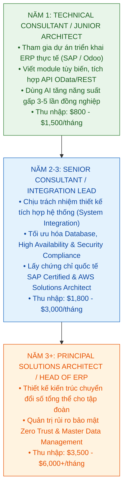

# Giai Đoạn 4: Nâng Tầm Thành Enterprise Solutions Architect
> **Thời gian:** Sau Tốt Nghiệp (Năm 1 — Năm 3 Đi Làm) | **Mục tiêu:** Trở thành Kỹ sư Kiến trúc Doanh nghiệp Cốt Cán với Mức Thu Nhập Dẫn Đầu

---

## 🎯 1. Mục Tiêu Cốt Lõi (Career Milestones)

1. Vượt lên trên 90% lập trình viên thông thường bằng cách kết hợp **Kỹ năng Kiến trúc Hệ thống + Nghiệp vụ ERP Chuyên sâu + Năng suất Đột phá từ AI Vibe Coding**.
2. Đạt các chứng chỉ kiến trúc quốc tế có giá trị cao nhất ngành ERP & Cloud.
3. Thăng tiến lên vị trí **Senior ERP Technical Consultant / Enterprise Solutions Architect** trong vòng 2–3 năm.

---

## 🗺️ 2. Lộ Trình Thăng Tiến Sự Nghiệp (Career Progression)

---

## 📚 3. Các Chứng Chỉ Quốc Tế Mục Tiêu Cần Chinh Phục

1. **Chứng chỉ Chuyên Môn SAP (SAP Official Certifications):**
   - *SAP Certified Development Associate - SAP BTP / ABAP with SAP NetWeaver*.
   - *SAP Certified Associate - SAP S/4HANA Cloud Integration*.
2. **Chứng chỉ Kiến Trúc Điện Toán Đám Mây (Cloud Architecture):**
   - *AWS Certified Solutions Architect - Associate / Professional*.
   - *CKA (Certified Kubernetes Administrator)*: Khẳng định năng lực vận hành cụm phân tán.
3. **Chứng chỉ Bảo Mật & Quản Trị Doanh Nghiệp (Security & Governance):**
   - *CISSP* hoặc *CISA (Certified Information Systems Auditor)*: Dành cho hướng kiểm toán công nghệ và bảo mật hệ thống thông tin.

---

## 🚀 4. Bí Quyết Duy Trì Lợi Thế Trong Kỷ Nguyên AI

1. **Không bao giờ làm việc thủ công những gì AI làm được trong 5 phút:**
   - Sử dụng AI để sinh mã nguồn module Odoo, viết Unit Tests, dựng API client, viết tài liệu kỹ thuật (Swagger/OpenAPI/Markdown).
2. **Tập trung 90% thời gian vào 3 thứ AI không thể thay thế:**
   - **Tư vấn giải pháp với khách hàng:** Lắng nghe bài toán kinh doanh phức tạp của doanh nghiệp, bóc tách luồng tiền, luật thuế, quy trình phê duyệt.
   - **Thiết kế kiến trúc hệ thống (System Architecture):** Quyết định chọn Database nào, phân vùng Sharding ra sao, bảo mật Zero Trust ở đâu, cơ chế đồng bộ dữ liệu thế nào để không mất mát giao dịch tài chính.
   - **Kiểm soát rủi ro & Tuân thủ pháp lý (Compliance):** Đảm bảo hệ thống đạt chuẩn kiểm toán SOX, ISO 27001, GDPR.

---

## 🏁 Lời Kết: Bạn Đã Có Mọi Thứ Để Khởi Đầu!

Dự án **Standalone Policy Decision Point (PDP)** này chính là **viên gạch nền móng đầu tiên** giúp bạn mở toang cánh cửa bước vào thế giới **Kỹ thuật Phần mềm Doanh nghiệp cấp cao**.

Hãy lưu giữ bộ tài liệu này, bám sát từng giai đoạn và tự tin chinh phục đỉnh cao sự nghiệp!
