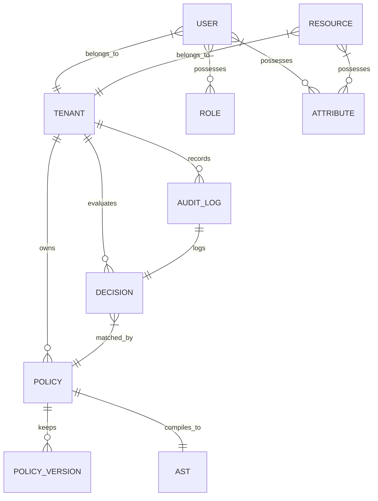

# Domain Model & Core Entities Specification

Tài liệu này đặc tả chi tiết mô hình nghiệp vụ (Domain Model) và cấu trúc 10 thực thể cốt lõi (Core Entities) của **Standalone Policy Engine**.

---

## 1. Bản đồ Thực thể Domain (Domain Entity Map)

---

## 2. Đặc tả Chi tiết 10 Thực thể Cốt lõi (Core Entities Specification)

### 1. Tenant (Khách thuê)
*   **Mô tả:** Đơn vị sở hữu tối cao dữ liệu. Mọi cấu trúc dữ liệu chính sách, định danh người dùng và log kiểm toán đều phải được cô lập theo Tenant ID.
*   **Các thuộc tính chính:**
    *   `ID` (UUID)
    *   `Name` (String)
    *   `Status` (Enum: ACTIVE, SUSPENDED)

### 2. User (Người dùng)
*   **Mô tả:** Đối tượng (Subject) gửi yêu cầu thực hiện hành động truy cập tài nguyên.
*   **Các thuộc tính chính:**
    *   `ID` (String, ví dụ: `user:alice`)
    *   `TenantID` (UUID)
    *   `Roles` (List of Roles)
    *   `Attributes` (List of Attributes)

### 3. Role (Vai trò)
*   **Mô tả:** Đại diện cho nhóm quyền của người dùng (RBAC). Hỗ trợ thừa kế vai trò (ví dụ: `super_admin` thừa kế các vai trò `admin` và `operator`).
*   **Các thuộc tính chính:**
    *   `ID` (String, ví dụ: `role:admin`)
    *   `InheritedRoles` (List of Role IDs)

### 4. Attribute (Thuộc tính)
*   **Mô tả:** Cặp khóa-giá trị động dùng để phân quyền ABAC. Được gán cho User, Resource hoặc lấy từ môi trường (Environment Context).
*   **Các thuộc tính chính:**
    *   `Key` (String, ví dụ: `ip_address`, `clearance_level`, `request_time`)
    *   `ValueType` (Enum: STRING, INTEGER, BOOLEAN, IP_ADDRESS, TIMESTAMP)
    *   `Value` (Any)

### 5. Policy (Chính sách)
*   **Mô tả:** Định nghĩa quy tắc phân quyền. Chứa thông tin DSL thuần và cấu trúc AST biên dịch sẵn.
*   **Các thuộc tính chính:**
    *   `ID` (UUID)
    *   `TenantID` (UUID)
    *   `Effect` (Enum: ALLOW, DENY)
    *   `PolicyText` (String - DSL thô)
    *   `Status` (Enum: ACTIVE, INACTIVE, DRAFT)

### 6. PolicyVersion (Phiên bản chính sách)
*   **Mô tả:** Bản lưu trữ lịch sử thay đổi của chính sách để phục vụ việc audit và rollback.
*   **Các thuộc tính chính:**
    *   `PolicyID` (UUID)
    *   `VersionNumber` (Integer)
    *   `PolicyText` (String)
    *   `CreatedAt` (Timestamp)
    *   `CreatedBy` (String)

### 7. Resource (Tài nguyên)
*   **Mô tả:** Thực thể cần được bảo vệ (ví dụ: file, API endpoint, project).
*   **Các thuộc tính chính:**
    *   `ID` (String, ví dụ: `file:doc.pdf`)
    *   `TenantID` (UUID)
    *   `Attributes` (List of Attributes, ví dụ: `owner="user:alice"`, `is_confidential=true`)

### 8. Action (Hành động)
*   **Mô tả:** Thao tác đối tượng muốn thực hiện lên tài nguyên (ví dụ: `READ`, `DELETE`, `PUBLISH`).
*   **Các thuộc tính chính:**
    *   `ID` (String, ví dụ: `action:DELETE`)

### 9. Decision (Quyết định phân quyền)
*   **Mô tả:** Kết quả đánh giá của Engine trả về cho PEP.
*   **Các thuộc tính chính:**
    *   `DecisionValue` (Enum: ALLOW, DENY)
    *   `Reason` (String)
    *   `MatchedPolicyID` (UUID - ID của chính sách quyết định)

### 10. AuditLog (Nhật ký kiểm toán)
*   **Mô tả:** Bản ghi bất biến (WORM) lưu lại mọi request và decision để phục vụ thanh tra.
*   **Các thuộc tính chính:**
    *   `ID` (BigInt)
    *   `TenantID` (UUID)
    *   `Subject` (String)
    *   `Action` (String)
    *   `Resource` (String)
    *   `Decision` (Enum: ALLOW, DENY)
    *   `EvaluatedAt` (Timestamp)
