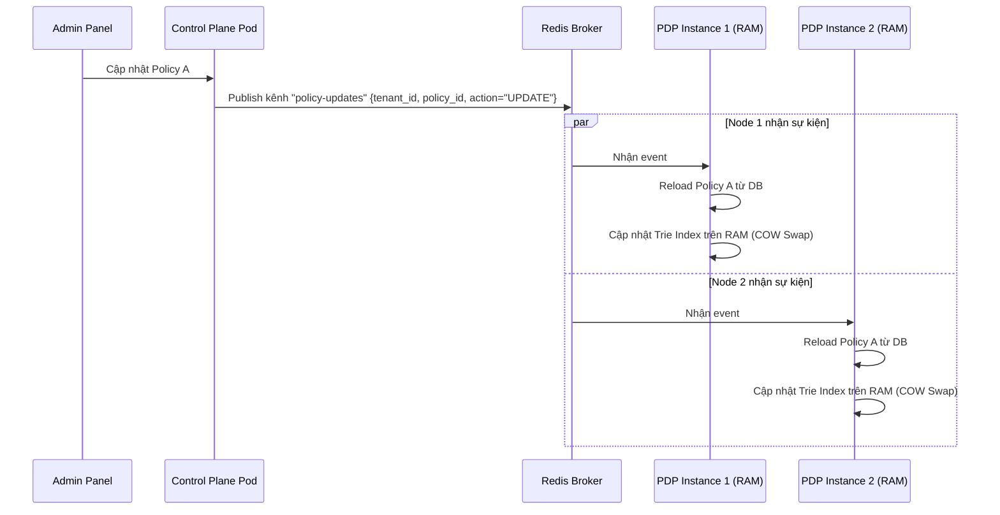

# Caching & Synchronization Strategy

Tài liệu này đặc tả chiến lược quản lý bộ nhớ đệm (Caching) và đồng bộ hóa trạng thái (Synchronization) giữa các node trong cluster **Standalone Policy Engine**.

---

## 1. Cơ chế Đồng bộ hóa RAM Cache (Cache Synchronization)

Vì Data Plane chạy hoàn toàn trên RAM phi trạng thái, khi Admin cập nhật chính sách ở Control Plane, sự thay đổi phải được đồng bộ hóa tức thì sang toàn bộ các node PDP đang chạy phân tán.

Chúng ta sử dụng kiến trúc **Pub/Sub Broker (Redis)** để phát tín hiệu đồng bộ:

*   **Thời gian đồng bộ mục tiêu:** `< 300ms` kể từ khi Admin lưu thành công chính sách.
*   **Fail-safe Mechanism (Cơ chế dự phòng):** Nếu kết nối Redis Broker bị sập, các PDP Pods sẽ tự động chuyển sang chế độ **Polling định kỳ** (gọi DB lấy phiên bản mới nhất sau mỗi 10 giây) để đảm bảo không bị lệch cache quá lâu.

---

## 2. Quản lý Vòng đời Cache (Cache Invalidation)

Để đảm bảo hiệu năng và tránh rò rỉ bộ nhớ khi chạy lâu dài, Engine thực hiện:
*   **Cơ chế cập nhật một phần (Granular Invalidation):** Khi có sự kiện thay đổi của một Policy ID cụ thể, Engine chỉ biên dịch và thay thế đúng node đó trên cây Trie, tuyệt đối không rebuild lại toàn bộ cây chính sách của Tenant để tránh lãng phí CPU.
*   **Tenant Active Cache Garbage Collection:** Nếu một Tenant hoàn toàn không có hoạt động CheckPermission nào trong vòng 24 giờ, PDP Pods sẽ tự động dọn dẹp (unload) toàn bộ cây chính sách của Tenant đó ra khỏi RAM để giải phóng bộ nhớ. Khi có request CheckPermission mới của Tenant đó đi vào, PDP sẽ thực hiện nạp lại nóng (lazy loading) từ PostgreSQL.
