# Performance Design, Capacity & Benchmarking Specification

Tài liệu này đặc tả các chỉ tiêu hiệu năng (Performance Targets), tính toán dung lượng phần cứng (Capacity Planning) và kế hoạch kiểm thử hiệu năng (Benchmark Plan) cho **Standalone Policy Engine**.

---

## 1. Chỉ tiêu Hiệu năng (Performance Targets)

Để đáp ứng mức tải của các hệ thống giao dịch tài chính quy mô lớn, Policy Engine thiết lập các hạn mức thời gian (Latency Budget) nghiêm ngặt sau:

```mermaid
gantt
    title Phân bổ độ trễ xử lý (Latency Budget) - Tổng mục tiêu < 1.0ms
    dateFormat  X
    axisFormat %s ms
    
    section Data Plane (PDP)
    Bắt tay mạng gRPC (HTTP/2 Multiplexing) :active, 0, 300
    Phân tích & Resolver Context            :active, 300, 450
    Tra cứu Trie Index tìm Policy khớp      :active, 450, 600
    Đánh giá AST biểu thức logic (ABAC)     :active, 600, 850
    Đẩy log quyết định sang Ring Buffer     :active, 850, 950
```

*   **Tổng thời gian phản hồi (End-to-End Response Time):** `< 1.0 ms` ở phân vị P95, `< 1.8 ms` ở phân vị P99.
*   **Thời gian xử lý nội bộ của Engine (Internal Processing Time):** `< 0.35 ms` ở phân vị P99.
*   **Thông lượng tối thiểu (Minimum Throughput):** `15,000 requests/giây` trên 1 vCPU (Cấu hình Intel Xeon Gold hoặc AMD EPYC tiêu chuẩn).

---

## 2. Tính toán dung lượng RAM (Capacity Planning)

Hệ thống lưu trữ toàn bộ chỉ mục chính sách trên RAM dưới dạng cấu trúc Radix Trie và cây AST đã được biên dịch.

### Công thức tính toán dung lượng bộ nhớ:

Giả định:
*   Mỗi policy thô có độ dài trung bình 200 ký tự (Cedar DSL).
*   Khi compile sang struct Go (AST nodes + Index metadata), mỗi node tiêu tốn trung bình `2.5 KB` RAM.
*   Mỗi khách thuê (Tenant) có trung bình 1,000 users và 10,000 tài nguyên, tương đương 5,000 policies.

| Quy mô hệ thống | Số lượng Policies trên RAM | Dung lượng RAM ước tính | Cấu hình máy chủ đề xuất (PDP Pod) |
| :--- | :--- | :--- | :--- |
| **Small (Chạy thử)** | 10,000 | ~ 25 MB | 0.5 vCPU - 128 MB RAM |
| **Medium (Enterprise)** | 100,000 | ~ 250 MB | 1.0 vCPU - 512 MB RAM |
| **Large (Large Scale SaaS)**| 1,000,000 | ~ 2.5 GB | 4.0 vCPU - 4.0 GB RAM |

*   > [!TIP]
    > Nhờ tối ưu hóa bằng Go struct không con trỏ rác và cơ chế nén Trie, dung lượng RAM tiêu thụ cực kỳ nhỏ. Điểm nghẽn tài nguyên duy nhất của PDP là **CPU** phục vụ việc so khớp chuỗi và tính toán biểu thức logic.

---

## 3. Kế hoạch Kiểm thử Hiệu năng (Benchmark Plan)

Chúng ta sẽ thực hiện 3 kịch bản stress test sử dụng công cụ **`ghz`** để đo đạc khả năng chịu tải:

### Kịch bản 1: Baseline Load Test (Tải tiêu chuẩn)
*   **Mục tiêu:** Đo đạc độ trễ cơ sở.
*   **Tham số:** 5,000 requests/giây duy trì liên tục trong 10 phút.
*   **Chỉ tiêu đạt:** Latency P99 `< 0.8ms`, tỷ lệ lỗi `0%`.

### Kịch bản 2: Spike Load Test (Tải đột biến)
*   **Mục tiêu:** Đánh giá khả năng hồi phục của hệ thống khi có lượng truy cập tăng vọt đột ngột.
*   **Tham số:** Tăng vọt từ 5,000 RPS lên 25,000 RPS trong vòng 5 giây, duy trì 30 giây rồi giảm về bình thường.
*   **Chỉ tiêu đạt:** Hệ thống không bị crash, không bị rò rỉ bộ nhớ (OOM), độ trễ P99 tạm thời tăng không quá 3.0ms và tự động giảm về `< 1.0ms` ngay sau khi spike kết thúc.

### Kịch bản 3: High Capacity Test (Tải cực đại trên lượng policy lớn)
*   **Mục tiêu:** Đo đạc hiệu năng khi RAM đang chứa 1,000,000 policies.
*   **Tham số:** Chạy stress test 15,000 RPS song song.
*   **Chỉ tiêu đạt:** Radix Trie Index hoạt động chính xác với độ phức tạp $O(\log N)$, thời gian tra cứu luật không bị suy giảm đáng kể so với khi chứa 10,000 policies.
