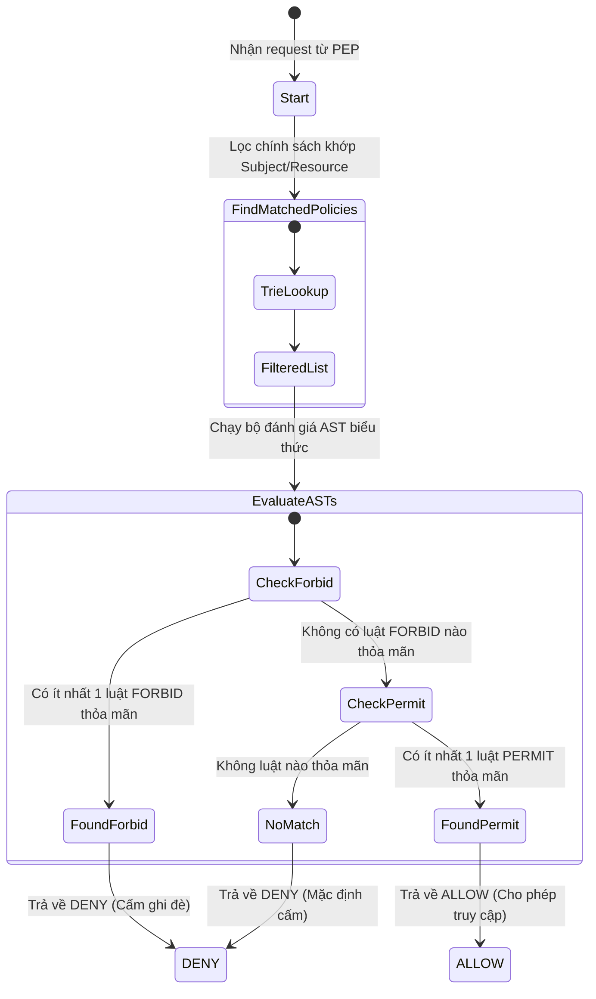

# Policy Evaluation Model

Tài liệu này đặc tả mô hình và thuật toán ra quyết định phân quyền (Decision Logic) của **Standalone Policy Engine**.

---

## 1. Mô hình Quyết định Nhị phân (ALLOW / DENY Decision)

Engine hoạt động theo cơ chế **Cấm ghi đè Cho phép (Forbid Overrides / Deny-by-Default)**. Quyết định cuối cùng được đưa ra dựa trên kết quả đánh giá của tất cả các chính sách khớp phạm vi:

### Các quy tắc cốt lõi:
1.  **Deny-by-Default (Mặc định cấm):** Nếu không tìm thấy bất kỳ chính sách nào khớp với yêu cầu của người dùng, kết quả mặc định luôn luôn là `DENY`.
2.  **Forbid Overrides (Cấm ghi đè):** Chỉ cần tồn tại duy nhất một quy tắc `forbid` khớp với yêu cầu và thỏa mãn điều kiện, quyết định cuối cùng lập tức là `DENY`, bất kể có bao nhiêu quy tắc `permit` cho phép đi chăng nữa.

---

## 2. Bảng chân trị Quyết định (Decision Truth Table)

Dưới đây là ma trận kết quả dựa trên số lượng luật `permit` và `forbid` khớp thỏa mãn điều kiện:

| Số luật PERMIT khớp | Số luật FORBID khớp | Quyết định cuối cùng (Decision) | Lý do hệ thống (Reason) |
| :---: | :---: | :---: | :--- |
| 0 | 0 | **DENY** | *No policies matched the request context.* |
| `>= 1` | 0 | **ALLOW** | *Access allowed by policy [ID].* |
| 0 | `>= 1` | **DENY** | *Access explicitly forbidden by policy [ID].* |
| `>= 1` | `>= 1` | **DENY** | *Access forbidden by policy [ID] overrides allow rules.* |
