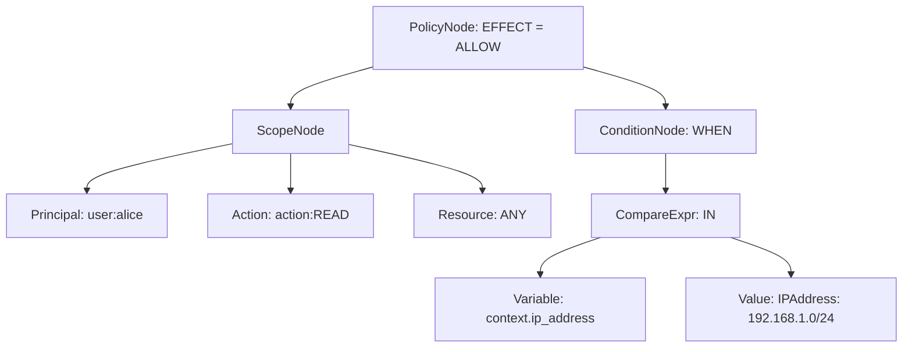

# Grammar Specification (EBNF)

Tài liệu này đặc tả chi tiết ngữ pháp hình thức (Formal Grammar) của ngôn ngữ chính sách phân quyền dưới định dạng **EBNF (Extended Backus-Naur Form)**. Đây là tài liệu nền tảng cho việc phát triển Lexer và Parser bằng Go.

---

## 1. Định nghĩa EBNF của Ngôn ngữ Chính sách

```ebnf
(* Cú pháp tổng thể của một Policy *)
Policy           = Effect "(" Scope ")" [ ConditionClause ] ";" ;

(* Hiệu lực quyết định *)
Effect           = "permit" | "forbid" ;

(* Phạm vi áp dụng *)
Scope            = PrincipalSpec "," ActionSpec "," ResourceSpec ;

PrincipalSpec    = "principal" Relation OpValue ;
ActionSpec       = "action" Relation OpValue ;
ResourceSpec     = "resource" Relation OpValue ;

Relation         = "==" | "in" ;
OpValue          = Identifier ":" StringLiteral | "any" ;

(* Mệnh đề điều kiện động (ABAC) *)
ConditionClause  = ( "when" | "unless" ) "{" Expression "}" ;

(* Các biểu thức logic & quan hệ *)
Expression       = LogicalOr ;

LogicalOr        = LogicalAnd { "||" LogicalAnd } ;
LogicalAnd       = RelationalExpr { "&&" RelationalExpr } ;

RelationalExpr   = PrimaryExpr [ RelOp PrimaryExpr ] ;
RelOp            = "==" | "!=" | ">" | "<" | ">=" | "<=" | "in" | "contains" ;

PrimaryExpr      = Value | Variable | "(" Expression ")" | "!" PrimaryExpr ;

(* Các thực thể biến & giá trị *)
Variable         = "principal" [ "." Identifier ] 
                 | "resource" [ "." Identifier ]
                 | "context" "." Identifier ;

Value            = StringLiteral | IntegerLiteral | BooleanLiteral | IPAddressLiteral ;

(* Các token cơ bản *)
Identifier       = Letter { Letter | Digit | "_" } ;
StringLiteral    = '"' { Character } '"' ;
IntegerLiteral   = [ "-" ] Digit { Digit } ;
BooleanLiteral   = "true" | "false" ;
IPAddressLiteral = Digit { Digit } "." Digit { Digit } "." Digit { Digit } "." Digit { Digit } [ "/" Digit { Digit } ] ;

Letter           = "a"..."z" | "A"..."Z" ;
Digit            = "0"..."9" ;
Character        = ? Tất cả các ký tự Unicode ngoại trừ dấu nháy kép ? ;
```

---

## 2. Quá trình sinh Token (Lexical Analysis)

Lexer sẽ đọc chuỗi text đầu vào và tách thành các Token sau:

| Mã Token | Ví dụ | Ý nghĩa |
| :--- | :--- | :--- |
| `EFFECT` | `permit`, `forbid` | Từ khóa quyết định. |
| `IDENTIFIER` | `principal`, `user`, `role` | Tên biến hoặc đối tượng định danh. |
| `REL_OP` | `==`, `in`, `contains` | Toán tử so sánh/quan hệ. |
| `LOGIC_OP` | `&&`, `\|\|`, `!` | Toán tử logic. |
| `LPAREN` / `RPAREN`| `(`, `)` | Cặp ngoặc tròn phân vùng phạm vi. |
| `LBRACE` / `RBRACE`| `{`, `}` | Cặp ngoặc nhọn bao mệnh đề điều kiện. |
| `STRING` | `"file:doc.pdf"` | Hằng chuỗi. |
| `INTEGER` | `100` | Hằng số nguyên. |
| `IP_ADDR` | `"192.168.1.1/24"` | Định dạng địa chỉ IP / Dải mạng Subnet. |

---

## 3. Ví dụ biểu diễn cây AST sau khi Parser phân tích

Với câu luật:
```cedar
permit(principal == user:alice, action == action:READ, resource == any)
when { context.ip_address in "192.168.1.0/24" };
```

Parser sẽ chuyển đổi thành cấu trúc cây AST như sau:


*Cây AST này sẽ được lưu trữ trực tiếp trên bộ nhớ RAM của PDP để phục vụ quá trình đánh giá quyền dynamic.*
