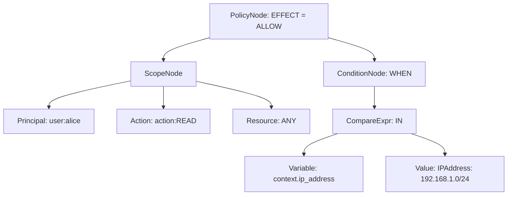

# Grammar Specification (EBNF)

Tài liệu này đặc tả chi tiết ngữ pháp hình thức (Formal Grammar) của ngôn ngữ chính sách phân quyền dưới định dạng **EBNF (Extended Backus-Naur Form)**, đã được tối ưu hóa để loại bỏ sự mập mờ từ vựng (Ambiguity) giữa Scope và Condition.

---

## 1. Định nghĩa EBNF của Ngôn ngữ Chính sách

```ebnf
(* Cú pháp tổng thể của một Policy *)
Policy           = Effect "(" Scope ")" [ ConditionClause ] ";" ;

(* Hiệu lực quyết định *)
Effect           = "permit" | "forbid" ;

(* Phạm vi áp dụng (Scope) - Sử dụng các toán tử tĩnh *)
Scope            = PrincipalSpec "," ActionSpec "," ResourceSpec ;

PrincipalSpec    = "principal" Relation OpValue ;
ActionSpec       = "action" Relation OpValue ;
ResourceSpec     = "resource" Relation OpValue ;

Relation         = "==" | "in" ;
OpValue          = Identifier ":" StringLiteral | "any" ;

(* Mệnh đề điều kiện động (ABAC) *)
ConditionClause  = ( "when" | "unless" ) "{" Expression "}" ;

(* Các biểu thức logic & quan hệ *)
Expression       = LogicalOr ;

LogicalOr        = LogicalAnd { "||" LogicalAnd } ;
LogicalAnd       = RelationalExpr { "&&" RelationalExpr } ;

RelationalExpr   = PrimaryExpr [ RelOp PrimaryExpr ] ;
RelOp            = "==" | "!=" | ">" | "<" | ">=" | "<=" | "in" | "contains" ;

PrimaryExpr      = Value | Variable | "(" Expression ")" | "!" PrimaryExpr ;

(* Các thực thể biến & thuộc tính động (Bắt buộc dùng accessor . để tránh Ambiguity) *)
Variable         = "principal" "." Identifier 
                 | "resource" "." Identifier
                 | "context" "." Identifier ;

Value            = StringLiteral | IntegerLiteral | BooleanLiteral | IPAddressLiteral ;

(* Các token cơ bản *)
Identifier       = Letter { Letter | Digit | "_" } ;
StringLiteral    = '"' { Character } '"' ;
IntegerLiteral   = [ "-" ] Digit { Digit } ;
BooleanLiteral   = "true" | "false" ;
IPAddressLiteral = Digit { Digit } "." Digit { Digit } "." Digit { Digit } "." Digit { Digit } [ "/" Digit { Digit } ] ;

Letter           = "a"..."z" | "A"..."Z" ;
Digit            = "0"..."9" ;
Character        = ? Tất cả các ký tự Unicode ngoại trừ dấu nháy kép ? ;
```

---

## 2. Giải pháp kỹ thuật loại bỏ Ambiguity (Stateful Lexing)

Để đảm bảo bộ Lexer/Parser không bị nhầm lẫn giữa từ khóa `"principal"` dùng làm biến trong mệnh đề `when` và phạm vi của Scope:

1.  **Ràng buộc Accessor bắt buộc:** Trong mệnh đề điều kiện `{...}`, không cho phép so sánh biến trần `principal` (ví dụ: `principal == "user:alice"` là không hợp lệ). Bắt buộc phải truy xuất thuộc tính thông qua dấu chấm accessor (ví dụ: `principal.id == "user:alice"`).
2.  **Stateful Lexer:** Lexer chuyển đổi trạng thái khi gặp token `{` (LBRACE) của mệnh đề `when`/`unless`. 
    *   *Trạng thái 0 (Out of condition):* Nhận diện các token Scope tĩnh.
    *   *Trạng thái 1 (In condition):* Phân tích các biểu thức ABAC động, từ khóa `principal` sẽ tự động được coi là biến đối tượng thay vì khai báo Scope.

---

## 3. Sơ đồ cây AST sau khi Parser phân tích

Với câu luật hợp lệ:
```cedar
permit(principal == user:alice, action == action:READ, resource == any)
when { context.ip_address in "192.168.1.0/24" };
```


