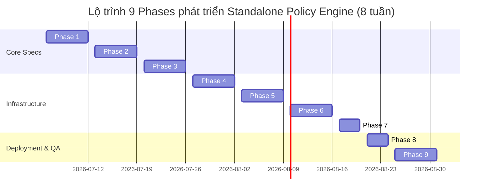

# Project Roadmap & Implementation Plan (Optimized)

Tài liệu này đặc tả lộ trình triển khai tối ưu hóa (9 Phases) của dự án **Standalone Policy Engine** tập trung vào Ngôn ngữ và Động cơ đánh giá trước khi đi vào các lớp hạ tầng phụ trợ.

---

## 1. Lộ trình Triển khai Cải tiến (9 Phases)

---

## 2. Kế hoạch Sprint Cập nhật

### Sprint 1: Policy Language Compiler & AST Parser (Tuần 1 - Tuần 2)
*   **Mục tiêu:** Hoàn thiện Lexer/Parser bằng Go, tự động biên dịch câu luật DSL thành cây AST.
*   **Các đầu việc chính:**
    1.  Cài đặt Tokenizer và Lexer máy trạng thái LL(1).
    2.  Xây dựng bộ Parser đệ quy sử dụng kỹ thuật Pratt Parsing.
    3.  Tích hợp các rules kiểm tra ngữ nghĩa và type checking.

### Sprint 2: In-Memory Index Trie & AST Evaluator (Tuần 3 - Tuần 4)
*   **Mục tiêu:** Xây dựng cấu trúc lưu trữ Radix Trie trên RAM và bộ đánh giá AST.
*   **Các đầu việc chính:**
    1.  Tạo chỉ mục Trie phân cấp Tenant/Subject/Resource.
    2.  Viết bộ Evaluator hỗ trợ so khớp IP Subnet và logic so sánh thời gian.
    3.  Hiện thực hóa cơ chế hoán đổi nguyên tử Copy-On-Write (COW).
    4.  Cài đặt `sync.Pool` tái sử dụng bộ nhớ context.

### Sprint 3: gRPC API, DB Sync & Audit Logs (Tuần 5 - Tuần 6)
*   **Mục tiêu:** Xây dựng gRPC Server, Control Plane CRUD và luồng ghi logs.
*   **Các đầu việc chính:**
    1.  Dựng gRPC Server sử dụng HTTP/2, mã hóa mTLS.
    2.  Thiết lập Schema Postgres, API quản lý và phát hành chính sách.
    3.  Cấu hình Redis Pub/Sub đồng bộ cache giữa các instance.
    4.  Viết Ring Buffer ghi Audit Logs bất đồng bộ.

### Sprint 4: Performance Matrix & Deployment manifests (Tuần 7 - Tuần 8)
*   **Mục tiêu:** Đánh giá hiệu năng và triển khai hạ tầng.
*   **Các đầu việc chính:**
    1.  Chạy stress test bằng `ghz` kiểm chứng ma trận tải (10 - 100,000 policies).
    2.  Cài đặt Prometheus metrics và Grafana dashboards.
    3.  Viết Dockerfile, Helm charts và Manifests Envoy Load Balancer.
