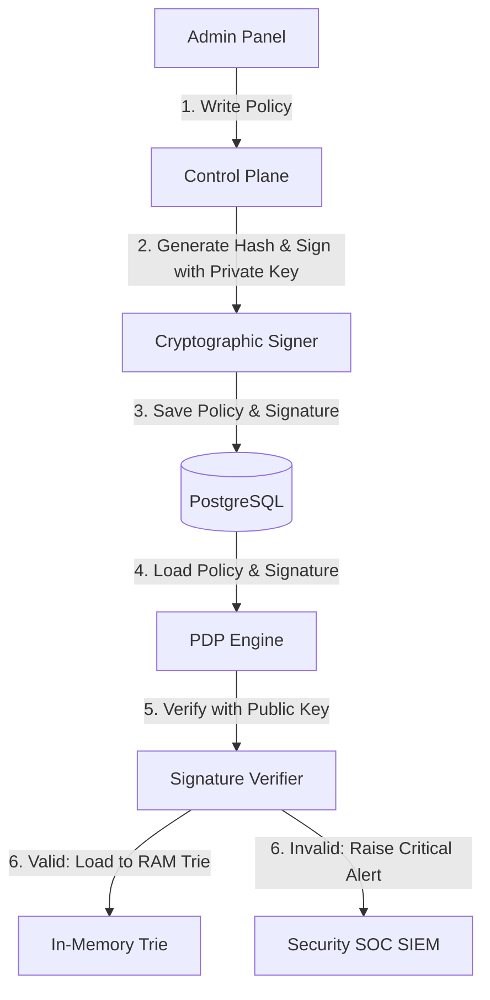

# Policy Tampering Prevention Specification

Tài liệu này đặc tả các biện pháp kiểm soát và phòng ngừa hành vi giả mạo chính sách (Policy Tampering) đối với **Standalone Policy Engine**.

---

## 1. Mối đe dọa Giả mạo Chính sách (The Tampering Threat)

Trong một hệ thống Enterprise, chính sách phân quyền chính là chìa khóa mở mọi cánh cửa. Nếu kẻ tấn công chiếm được quyền truy cập Database (SQL Injection hoặc đánh cắp tài khoản superuser), họ có thể sửa đổi tệp luật phân quyền để tự cấp quyền cho mình (ví dụ: Thay đổi luật từ cấm sang cho phép, hoặc sửa đổi điều kiện IP).

---

## 2. Giải pháp Phòng thủ (Defense Controls)

Để ngăn chặn tuyệt đối việc thực thi các chính sách đã bị giả mạo ở tầng lưu trữ, Engine áp dụng cơ chế **Ký số Mật mã học (Cryptographic Policy Signing)**:

### Cơ chế kỹ thuật:
1.  **Ký số bằng khóa riêng tư (Private/Public Key Pair):**
    *   Control Plane nắm giữ một Khóa riêng tư bảo mật (ví dụ: thuật toán ED25519 hoặc ECDSA P-256) được lưu trữ trong Hardware Security Module (HSM) hoặc Cloud Key Management Service (KMS).
    *   Khi Admin tạo hoặc sửa đổi một chính sách, Control Plane sẽ băm nội dung chính sách (`policy_text + tenant_id + version`) và ký số lên mã băm đó để tạo ra trường `signature`.
2.  **Xác thực tại Data Plane (PDP Verification):**
    *   PDP nắm giữ khóa công khai (Public Key).
    *   Khi PDP khởi động hoặc nhận được sự kiện cập nhật chính sách, trước khi compile AST và nạp vào RAM Trie, PDP bắt buộc phải dùng khóa công khai để xác thực trường `signature`.
    *   Nếu chữ ký số hợp lệ: Chính sách được nạp.
    *   Nếu chữ ký số không khớp (chứng tỏ chính sách đã bị sửa đổi trực tiếp dưới DB mà không qua Control Plane): PDP sẽ **từ chối nạp chính sách này vào RAM**, đồng thời phát cảnh báo an ninh cấp độ **CRITICAL** sang hệ thống SOC SIEM để Incident Response Team vào cuộc điều tra ngay lập tức.
