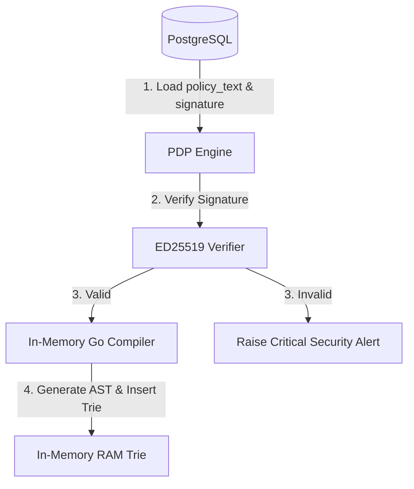

# Policy Tampering Prevention Specification

Tài liệu này đặc tả các biện pháp kiểm soát và phòng ngừa hành vi giả mạo chính sách (Policy Tampering) đối với **Standalone Policy Engine**.

---

## 1. Mối đe dọa Giả mạo Chính sách & Kẽ hở Bypass qua AST

Kẻ tấn công chiếm được quyền truy cập Database có thể tìm cách sửa đổi trực tiếp dữ liệu chính sách để tự nâng quyền. Nếu hệ thống lưu trữ song song chuỗi text DSL (`policy_text`) và cây AST đã biên dịch dưới dạng JSON (`ast_json`), một kẽ hở nghiêm trọng có thể xảy ra:
*   Kẻ tấn công giữ nguyên chuỗi `policy_text` thô và `signature` hợp lệ của nó.
*   Kẻ tấn công sửa trực tiếp cấu trúc JSON trong trường `ast_json` (ví dụ sửa effect từ `forbid` thành `permit`).
*   Nếu PDP verify chữ ký trên `policy_text` thành công rồi deserialize trực tiếp `ast_json` lên RAM để chạy, cơ chế bảo mật chữ ký số sẽ bị bypass hoàn toàn.

---

## 2. Giải pháp Phòng thủ chống Bypass (Tampering Protections)

Hệ thống triển khai mô hình **Verify-then-Compile (Xác thực rồi mới Biên dịch)** để triệt tiêu hoàn toàn rủi ro trên:

### Chi tiết cơ chế kiểm soát:
1.  **Chữ ký số ED25519:**
    *   Mọi chính sách được ký số ở Control Plane bằng khóa riêng tư bảo mật lưu trong KMS/HSM. Chữ ký được tính trên chuỗi ghép: `tenant_id + policy_text + version`.
2.  **Nguyên tắc "Không tin tưởng AST tĩnh":**
    *   PDP tuyệt đối không đọc cấu trúc AST đã được deserialize sẵn từ Database.
    *   Khi PDP load chính sách từ DB lên, nó bắt buộc phải kiểm tra chữ ký số trên trường `policy_text`.
    *   Nếu chữ ký số hợp lệ: PDP kích hoạt trình biên dịch Go nội bộ (internal compiler) để tự parse và compile chuỗi `policy_text` thô thành cấu trúc AST trực tiếp trên RAM.
    *   Cơ chế này đảm bảo cây AST thực thi trên bộ nhớ RAM luôn đi ra từ chuỗi text thô đã được ký số và xác thực thành công.
3.  **Báo động SIEM:**
    *   Nếu phát hiện chữ ký không khớp, chính sách bị cô lập ngay lập tức, PDP phát tín hiệu báo động đỏ sang SIEM SOC để phong tỏa tài khoản DBA hoặc điều tra lỗ hổng DB.
