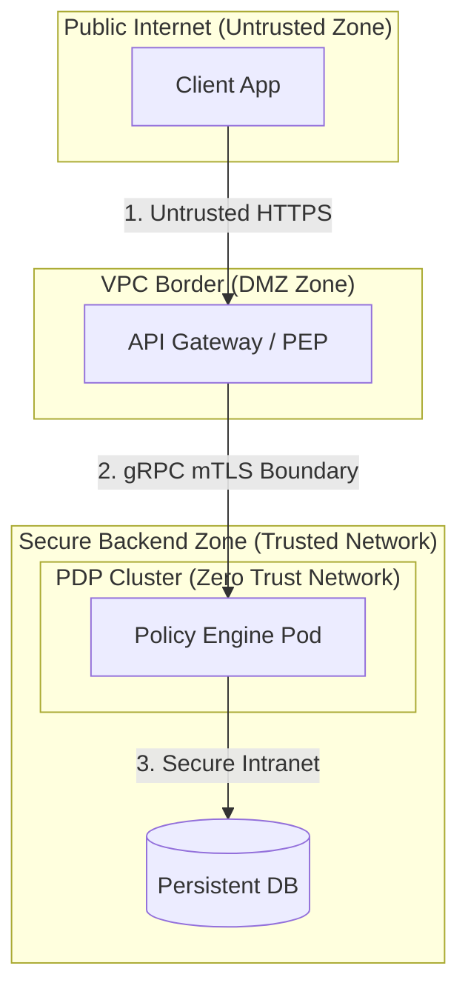

# Security Architecture Overview & Controls

Tài liệu này đặc tả thiết kế bảo mật, ranh giới tin cậy (Trust Boundaries) và các biện pháp kiểm soát an ninh (Security Controls) của **Standalone Policy Engine** nhằm đáp ứng các tiêu chuẩn an toàn cấp ngân hàng và Zero Trust.

---

## 1. Triết lý Bảo mật (Security Philosophy)

*   **Zero Trust (NIST SP 800-207):** Policy Engine không tin tưởng bất kỳ request nào đi vào, kể cả khi nó xuất phát từ mạng nội bộ. Mọi yêu cầu phân quyền gRPC bắt buộc phải được mã hóa, xác thực và định danh rõ ràng.
*   **Least Privilege (Quyền hạn tối thiểu):** Mặc định từ chối tất cả truy cập (**Deny-by-Default**). Chỉ cho phép nếu có luật ALLOW tường minh.
*   **Policy-as-Code:** Quy trình cập nhật chính sách phải qua kiểm tra cú pháp AST nghiêm ngặt trên Control Plane trước khi được áp dụng vào Data Plane để ngăn chặn các thay đổi trái phép.

---

## 2. Ranh giới Tin cậy (Trust Boundaries)

Hệ thống phân chia ranh giới tin cậy rõ ràng giữa các phân vùng mạng và các lớp ứng dụng:

*   **Ranh giới 1 (Untrusted HTTPS):** Client gửi request từ Internet vào API Gateway. Phân vùng này hoàn toàn không tin cậy. Gateway chịu trách nhiệm xác thực người dùng (Authentication) và lọc traffic thô.
*   **Ranh giới 2 (gRPC mTLS Boundary):** Đường truyền giữa API Gateway (PEP) và Policy Engine (PDP). Đây là ranh giới Zero Trust. Đường truyền này bắt buộc phải sử dụng **mTLS (Mutual TLS)** với chứng chỉ X.509 do CA nội bộ cấp phát. PDP sẽ kiểm tra chứng chỉ của Gateway và ngược lại.
*   **Ranh giới 3 (Database Zone):** PDP truy cập Database để nạp chính sách. Phân vùng này nằm sâu trong mạng nội bộ bảo mật cao, chỉ chấp nhận kết nối từ IP của PDP cluster.

---

## 3. Các Biện pháp Kiểm soát An ninh (Security Controls)

Hệ thống triển khai 4 lớp kiểm soát bảo mật chính:

| Lớp bảo vệ | Biện pháp kiểm soát (Security Control) | Chi tiết triển khai |
| :--- | :--- | :--- |
| **Network Security** | gRPC mTLS | Sử dụng TLS 1.3 ALPN Enforced. Chỉ các Gateway có chứng chỉ hợp lệ mới được gọi API phân quyền. |
| **Application Security** | AST Validator | Control Plane chạy parser và semantic check trước khi lưu policy. Ngăn ngừa tấn công **Policy Injection** (bằng cách tiêm mã độc vào DSL). |
| **Memory Security** | AST Depth Limitation | Giới hạn độ sâu tối đa của cây AST (ví dụ tối đa 15 cấp). Ngăn chặn kẻ tấn công cố tình viết luật quá phức tạp để kích hoạt lỗi tràn bộ nhớ hoặc chiếm dụng 100% CPU (DoS). |
| **Database Security** | Tenant-Isolation | Lưu trữ chính sách có phân cách `tenant_id` rõ ràng. Mọi query từ RAM index trie bắt buộc phải lọc theo `tenant_id` lấy từ token định danh. |
| **Audit Controls** | Immutable Decision Logs | Nhật ký quyết định phân quyền được ghi bất biến thông qua cơ chế ghi log bất đồng bộ, chuyển tiếp sang hệ thống lưu trữ tập trung của SOC SIEM để giám sát liên tục. |
