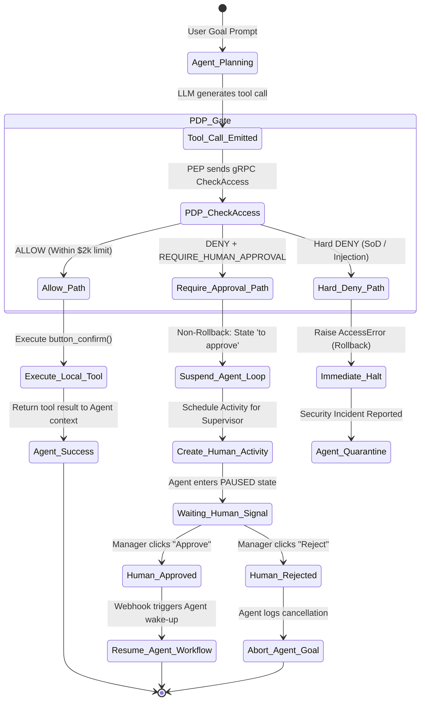

# AGENT_TOOLING_SPEC.md — AI Agent Tooling & Feedback Loop Specification

## 1. Tool-Call Schema (OpenAI / LangChain Compatible)

```json
{
  "type": "function",
  "function": {
    "name": "tools_erp_approve_purchase_order",
    "description": "Approve an ERP purchase order under delegated authority. Triggers PDP deterministic security guardrails before execution.",
    "parameters": {
      "type": "object",
      "properties": {
        "order_id": {
          "type": "string",
          "description": "The unique enterprise identifier of the purchase order, e.g. 'PO00042'"
        },
        "amount_total": {
          "type": "integer",
          "description": "Total order amount in raw units (no decimals/commas), e.g. 1500 for $1,500"
        },
        "currency": {
          "type": "string",
          "enum": ["USD", "VND", "EUR"],
          "description": "Standard 3-letter ISO currency code"
        },
        "justification": {
          "type": "string",
          "description": "AI-generated rationale for executing this automated procurement tool"
        }
      },
      "required": ["order_id", "amount_total", "currency", "justification"]
    }
  }
}
```

---

## 2. ToolExecutionContext Packaging Protocol

Khi Tác tử AI kích hoạt công cụ trên Odoo PEP, ngữ cảnh thực thi (`ToolExecutionContext`) bắt buộc phải được đóng gói theo định dạng chuẩn trước khi gửi sang gRPC PDP:

```python
# Packaging structure inside Agent Runtime Wrapper
tool_execution_context = {
    # 1. Định danh công cụ
    "tool_name": "tools_erp_approve_purchase_order",
    "tool_context": "tool:auto_confirm_po",
    
    # 2. Chế độ thực thi & Ngưỡng rủi ro
    "execution_mode": "autonomous_run",        # "autonomous_run" | "human_supervised"
    "tool_risk_level": "HIGH_FINANCIAL",
    
    # 3. Chuỗi định danh ủy quyền (1-Hop)
    "delegation_grant_id": str(grant.id),
    "delegation_chain": f"user:{grant.user_id.login},agent:{agent_id}",
    "delegation_proof": grant.generate_proof("tool:auto_confirm_po", order.amount_total),
    
    # 4. Ngữ cảnh tài nguyên (PIP)
    "resource.creator_id": f"user:{order.create_uid.login}",
    "resource.department": order.department_id.name or "General",
    "amount": str(int(order.amount_total)),
    "currency": order.currency_id.name,
    
    # 5. Dấu vết kiểm toán (Telemetry Trace)
    "trace_id": f"trace-ai-{order.id}-{int(time.time())}",
    "agent_model": "gemini-1.5-pro"
}
```

---

## 3. Feedback Loop State Machine: Xử Lý Khi Gặp `REQUIRE_HUMAN_APPROVAL`



### 3.1. Hành Xử Của AI Agent Khi Nhận Quyết Định

| Trạng thái phản hồi từ PDP | Mã phản hồi trả về Prompt Context của Agent | Hành động tiếp theo của Agent Runtime | Trạng thái chứng từ trên ERP |
|---|---|---|---|
| **`ALLOW`** | `{"status": "SUCCESS", "order_id": "PO00042", "confirmed": true}` | Tiếp tục vòng lặp tự trị để hoàn thành mục tiêu ban đầu. | `state = 'purchase'` (Xác nhận thành công). |
| **`DENY` + `REQUIRE_APPROVAL`** | `{"status": "SUSPENDED", "obligation": "REQUIRE_HUMAN_APPROVAL", "routed_to": "role:director"}` | **Tạm dừng vòng lặp (Pause Loop)**; không thử gọi lại (no retry); phát thông báo tới người giám sát. | `state = 'to approve'` (Giữ nguyên bản ghi, không rollback). |
| **`Hard DENY` (SoD/Vi phạm cứng)** | `{"status": "FATAL_SECURITY_ERROR", "code": "POLICY_VIOLATION"}` | **Dừng khẩn cấp (Abort Execution)**; ghi log bảo mật; tự hủy phiên làm việc. | Bị rollback toàn bộ về trạng thái trước đó. |
