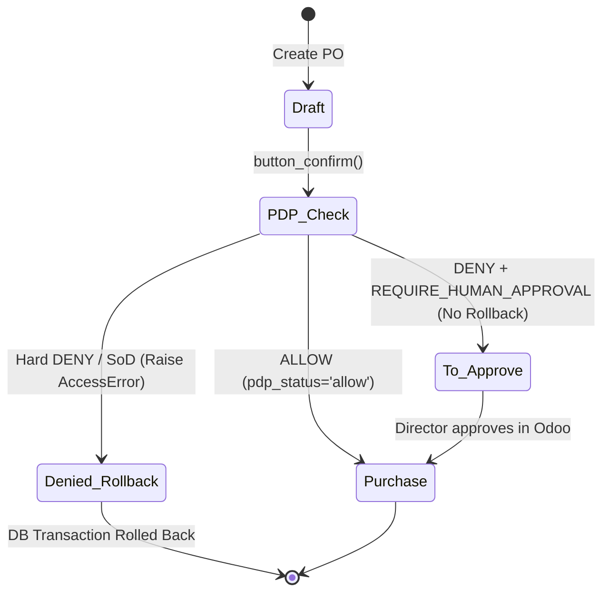

# PEP_ODOO_INTEGRATION.md — Odoo 17 PEP Technical Specification

## 1. Odoo ORM Hook Architecture

### 1.1. Model Inheritance & Interception Point
The PEP intercepts purchase order confirmation by overriding `button_confirm()` on `purchase.order`:

```python
# custom_addons/pdp_authorizer/models/purchase_order.py
from odoo import models, fields, api, _
from odoo.exceptions import AccessError, UserError
from .pdp_client import get_pdp_client

class PurchaseOrder(models.Model):
    _inherit = "purchase.order"

    pdp_status = fields.Selection([
        ('pending', 'Pending PDP Check'),
        ('allow', 'Allowed'),
        ('require_approval', 'Requires Human Approval'),
        ('deny', 'Denied')
    ], string="PDP Decision Status", default='pending', readonly=True, copy=False)
    
    ai_agent_id = fields.Char("Executing AI Agent ID", readonly=True, copy=False)
    delegated_by_id = fields.Many2one("res.users", "Delegating Principal", readonly=True, copy=False)
    delegation_grant_id = fields.Many2one("pdp.delegation.grant", "Delegation Grant", readonly=True, copy=False)

    def button_confirm(self):
        for order in self:
            decision, obligations, advice = order._evaluate_pdp_access()
            
            if decision == "ALLOW":
                order.write({'pdp_status': 'allow'})
                return super(PurchaseOrder, order).button_confirm()
                
            elif decision == "DENY":
                if "REQUIRE_HUMAN_APPROVAL" in obligations:
                    # Non-rollback transition to approval state
                    order.write({
                        'state': 'to approve',
                        'pdp_status': 'require_approval'
                    })
                    order._schedule_supervisor_activity(advice)
                    return True
                else:
                    # Hard Deny / SoD violation -> Transaction rollback
                    order.write({'pdp_status': 'deny'})
                    raise AccessError(_("PDP Policy Denied: Action prohibited by security rules."))
                    
        return True
```

---

## 2. PID-Safe gRPC Client for Pre-Fork Multi-Process Workers

### 2.1. C-Core Epoll Fork Safety
Odoo uses `gevent` or pre-fork multi-process workers (`workers > 0`). Sharing an initialized `grpc.Channel` across an `os.fork()` call leads to deadlocks inside the C-core `epoll` engine. 

### 2.2. Thread-Local & Process-Safe Client Singleton
```python
# custom_addons/pdp_authorizer/models/pdp_client.py
import os
import threading
import grpc
from policy_v1_pb2_grpc import PolicyDecisionPointStub

class SafePDPClient:
    _instance = None
    _lock = threading.Lock()

    def __init__(self, target="localhost:50051", timeout=0.5):
        self._target = target
        self._timeout = timeout
        self._pid = os.getpid()
        self._channel = None
        self._stub = None
        self._init_channel()

    def _init_channel(self):
        self._channel = grpc.insecure_channel(
            self._target,
            options=[
                ('grpc.keepalive_time_ms', 10000),
                ('grpc.keepalive_timeout_ms', 2000),
                ('grpc.keepalive_permit_without_calls', True),
                ('grpc.http2.max_pings_without_data', 0),
            ]
        )
        self._stub = PolicyDecisionPointStub(self._channel)

    def get_stub(self):
        current_pid = os.getpid()
        if current_pid != self._pid:
            # Worker process was forked -> Recreate channel
            with self._lock:
                if current_pid != self._pid:
                    self._pid = current_pid
                    self._init_channel()
        return self._stub

_client_singleton = None

def get_pdp_client():
    global _client_singleton
    if _client_singleton is None:
        _client_singleton = SafePDPClient()
    return _client_singleton
```

---

## 3. Non-Rollback State Machine Coordination



### 3.1. Activity Scheduling Implementation
```python
def _schedule_supervisor_activity(self, advice):
    approver_role = advice.get("required_approver_role", "role:manager")
    approver = self._resolve_user_by_role(approver_role)
    self.activity_schedule(
        activity_type_id=self.env.ref('mail.mail_activity_data_todo').id,
        summary=f"Phê duyệt yêu cầu vượt ngưỡng AI: PO {self.name}",
        note=advice.get("reason", "Khoản chi vượt hạn mức tự trị của AI Agent."),
        user_id=approver.id
    )
```

---

## 4. Schema Model: `pdp.delegation.grant`

### 4.1. PostgreSQL Table / Model Specification
```python
# custom_addons/pdp_authorizer/models/delegation_grant.py
from odoo import models, fields, api
import hmac
import hashlib
import time

class PdpDelegationGrant(models.Model):
    _name = "pdp.delegation.grant"
    _description = "AI Agent Delegation Grant"

    user_id = fields.Many2one("res.users", "Delegating Principal", required=True, index=True)
    agent_id = fields.Char("Agent Identifier", required=True, index=True) # e.g. "agent:procurement_copilot"
    max_amount = fields.Float("Autonomous Spending Ceiling", required=True)
    valid_from = fields.Datetime("Valid From", default=fields.Datetime.now, required=True)
    valid_until = fields.Datetime("Valid Until", required=True)
    state = fields.Selection([
        ('draft', 'Draft'),
        ('active', 'Active'),
        ('revoked', 'Revoked'),
        ('expired', 'Expired')
    ], default='draft', index=True)
    
    shared_secret = fields.Char("Signing Secret", copy=False)
    proof_token = fields.Char("Current HMAC Signature", compute="_compute_proof")

    def action_activate(self):
        self.write({'state': 'active'})

    def action_revoke(self):
        for rec in self:
            rec.write({'state': 'revoked'})
            # Notify Go PDP In-Memory Revocation Blacklist
            client = get_pdp_client()
            client.revoke_delegation(
                tenant_id=rec.user_id.company_id.name,
                session_id=str(rec.id),
                revoked_by=f"user:{rec.env.user.login}"
            )

    def generate_proof(self, tool_name, amount):
        payload = f"{self.user_id.login}|{self.agent_id}|{tool_name}|{int(amount)}|{int(time.time())}"
        return hmac.new(
            self.shared_secret.encode('utf-8'),
            payload.encode('utf-8'),
            hashlib.sha256
        ).hexdigest()
```
