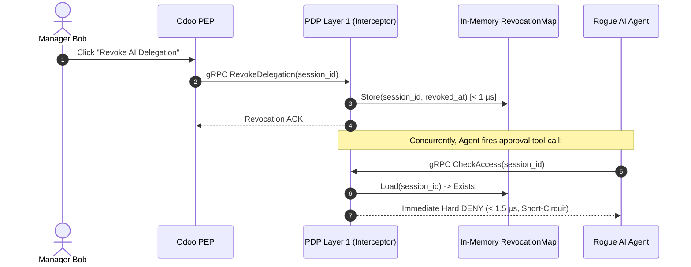

# SECURITY_INVARIANTS.md — Mathematical Model & Security Invariants

## 1. Formal Model of Constrained Delegation ($\Delta$)

The delegation of authority from an authenticated human principal to an autonomous AI agent is formally modeled as a 5-tuple:

$$\Delta = \langle \mathcal{U}_{\text{root}}, \mathcal{A}_{\text{exec}}, \Sigma_{\text{scope}}, \Omega_{\text{constraints}}, \mathcal{C}_{\text{chain}} \rangle$$

| Symbol | Element | Definition | Enterprise Example |
|---|---|---|---|
| $\mathcal{U}_{\text{root}}$ | Root Delegator | The authoritative human principal delegating power | `user:manager_bob` |
| $\mathcal{A}_{\text{exec}}$ | Delegatee Agent | The autonomous workload or AI execution identity | `agent:procurement_copilot` |
| $\Sigma_{\text{scope}}$ | Functional Scope | Permitted set of actions, tools, and resource classes | `action:APPROVE_PO` on `resource:purchase_order` |
| $\Omega_{\text{constraints}}$ | Guardrail Boundaries | Operational limits: budget ceilings, TTL, IP whitelists | $\text{amount} \le 2000$, $\text{valid\_until} \le t_{\text{exp}}$ |
| $\mathcal{C}_{\text{chain}}$ | Delegation Lineage | Directed delegation graph: $\mathcal{U}_{\text{root}} \to \mathcal{A}_{\text{exec}}$ ($\text{Depth} = 1$) | `"user:manager_bob,agent:procurement_copilot"` |

---

## 2. Core Security Invariants

### Invariant 1: Time-Aware Monotonic Attenuation
An agent's effective permissions $\mathcal{P}_{\text{effective}}$ at time $t$ can **never** exceed the delegator's active rights, bounded strictly by delegation scope and deterministic guardrails:

$$\mathcal{P}_{\text{effective}}(\mathcal{A} \mid \mathcal{U}, t) = \mathcal{P}_{\text{active}}(\mathcal{U}, t) \cap \mathcal{S}_{\text{delegation}} \cap \Omega_{\text{guardrails}}$$

- **Dynamic Collapse**: If at time $t$, $\mathcal{U}_{\text{root}}$ is suspended, departs the organization, or exhausts their daily approval limit, $\mathcal{P}_{\text{active}}(\mathcal{U}, t) \to \emptyset$, causing $\mathcal{P}_{\text{effective}}(\mathcal{A})$ to collapse to $\emptyset$ immediately.
- **Evaluation Mechanism**: Handled without external database lookups via pre-extracted context attributes (`context.delegator_status`, `context.delegator_limit`) in memory.

---

### Invariant 2: Generalized Separation of Duties (SoD)
The resource creator is prohibited from appearing anywhere within the approval delegation chain:

$$\mathcal{U}_{\text{creator}} \notin \mathcal{C}_{\text{chain}}(\text{Approver})$$

- **Threat Vector**: A malicious user creates a fraudulent purchase order, then triggers an AI Copilot (either their own or an AI acting under delegation from their manager) to approve the order.
- **Engine Enforcement**: Implemented in [`evaluator.go:387`](file:///e:/Projects/Project_TN/standalone-policy-engine/internal/engine/evaluator.go#L387) using `BinOpContains`:
  ```cedar
  forbid(
      principal == any,
      action    == action:APPROVE_PURCHASE_ORDER,
      resource  == any
  )
  when {
      context.delegation_chain contains resource.creator_id
  };
  ```

---

### Invariant 3: Enforcement Point Integrity & Non-Repudiation
Contextual attributes self-reported across process boundaries must be cryptographically verifiable:

$$\text{Proof} = \text{HMAC-SHA256}\Big(K_{\text{shared}}, \; \mathcal{U}_{\text{root}} \parallel \mathcal{A}_{\text{exec}} \parallel \text{action} \parallel \text{amount} \parallel \text{nonce} \parallel \text{timestamp}\Big)$$

- **Threat Vector**: A rogue actor crafts arbitrary JSON requests with forged `delegation_chain: "user:cfo_john,agent:copilot"`.
- **Architectural Boundary**:
  - Verification occurs exclusively at **Layer 1: gRPC Security Interceptor** ([`internal/security/auth.go`](file:///e:/Projects/Project_TN/standalone-policy-engine/internal/security/auth.go)).
  - Hot-path In-Memory Evaluator (**Layer 2**) receives only cryptographically verified, clean requests, preserving the 27ns latency budget.

---

## 3. Real-Time Revocation & TOCTOU Mitigation

**Time-of-Check to Time-of-Use (TOCTOU)** vulnerability occurs if user revocation in ERP takes seconds to propagate while an agent fires automated tool-calls in milliseconds.



- **Data Structure**: `sync.Map` or read-optimized concurrent hashmap storing active revocations with TTL.
- **Complexity**: $O(1)$ lookup time ($< 1\,\mu\text{s}$), zero disk persistence needed on evaluation path.
