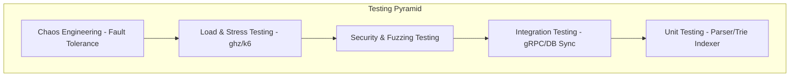

# Testing Strategy Specification

Tài liệu này đặc tả chiến lược kiểm thử toàn diện (Testing Strategy) cho **Standalone Policy Engine**, bao gồm kiểm thử đơn vị (Unit Test), kiểm thử tích hợp (Integration Test), kiểm thử hiệu năng (Load/Stress Test), kiểm thử an ninh (Security Test) và kiểm thử độ bền bỉ (Chaos Engineering).

---

## 1. Các Phân lớp Kiểm thử (Testing Layers)

### A. Kiểm thử Đơn vị (Unit Testing)
*   **Mục tiêu:** Kiểm tra logic nội bộ của từng module cô lập.
*   **Trọng tâm:**
    *   **Parser & AST Evaluator:** Kiểm thử tất cả các cú pháp DSL, bao gồm cả các cú pháp đúng và các cú pháp lỗi cố ý để xem parser có bắt đúng lỗi không.
    *   **Radix Trie Indexer:** Kiểm thử độ chính xác của thuật toán tìm kiếm và lọc chính sách theo Tenant/Subject/Resource.
*   **Chỉ tiêu:** Code coverage tối thiểu đạt **`90%`**.

### B. Kiểm thử Tích hợp (Integration Testing)
*   **Mục tiêu:** Kiểm tra sự tương tác giữa các module và các hệ thống bên ngoài.
*   **Trọng tâm:**
    *   **gRPC Handler & Client SDK:** Test việc truyền tải request gRPC qua lại và xử lý mã lỗi.
    *   **Postgres Sync:** Test luồng lưu chính sách ở Control Plane, phát sự kiện Pub/Sub và kiểm tra xem Data Plane có cập nhật RAM cache chính xác không.

### C. Kiểm thử Hiệu năng & Tải (Load & Stress Testing)
*   **Mục tiêu:** Đo đạc độ trễ và thông lượng thực tế dưới tải cực lớn.
*   **Trọng tâm:**
    *   Sử dụng công cụ **`ghz`** để chạy stress test 100,000 requests gRPC.
    *   Mô phỏng 100 kết nối TCP song song duy trì liên tục để kiểm tra xem `sync.RWMutex` có bị hiện tượng nghẽn luồng (Lock Contention) hay không.

### D. Kiểm thử An ninh (Security & Fuzzing Testing)
*   **Fuzz Testing:** Sử dụng tính năng Go Fuzzing (`go test -fuzz`) để sinh ngẫu nhiên hàng triệu chuỗi ký tự rác truyền vào bộ Parser DSL, nhằm phát hiện sớm các kịch bản gây sập Engine (Panic).
*   **Security Integration:** Kiểm thử việc chặn đứng request khi token mTLS hết hạn hoặc chứng chỉ CA bị thu hồi (CRL list).

### E. Kiểm thử Bền bỉ (Chaos Engineering)
*   Mô phỏng sự cố mạng, ngắt kết nối đột ngột giữa PDP và PostgreSQL.
*   *Yêu cầu:* PDP phải tiếp tục phục vụ các yêu cầu phân quyền bình thường dựa trên RAM cache mà không được trả về lỗi hay làm crash dịch vụ.
