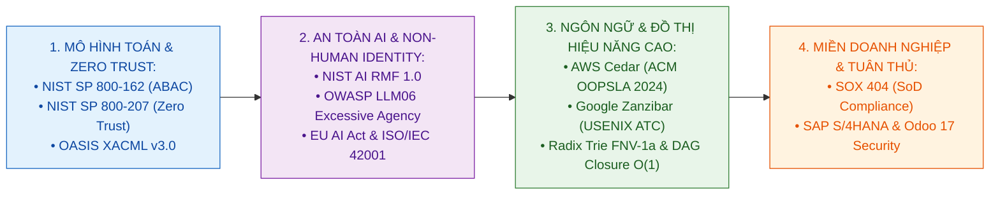
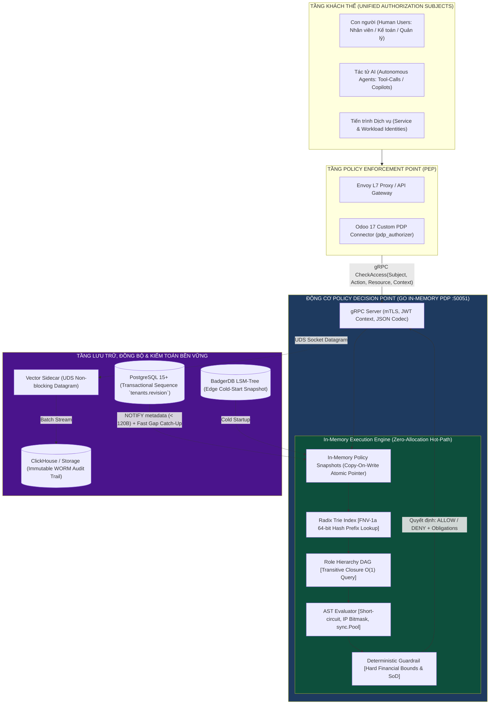

# BỘ GIÁO DỤC VÀ ĐÀO TẠO
## KHOA CÔNG NGHỆ THÔNG TIN — BỘ MÔN KỸ THUẬT PHẦN MỀM

---

# ĐỀ CƯƠNG CHI TIẾT ĐỒ ÁN TỐT NGHIỆP ĐẠI HỌC
### HỆ ĐÀO TẠO: KỸ SƯ / CỬ NHÂN CHÍNH QUY — CHUYÊN NGÀNH KỸ THUẬT PHẦN MỀM

---

## PHẦN A. THÔNG TIN HÀNH CHÍNH VÀ ĐỊNH DANH ĐỀ TÀI

* **Tên đề tài (Tiếng Việt):**
  > **XÂY DỰNG CƠ CHẾ POLICY DECISION POINT HỖ TRỢ ỦY QUYỀN CÓ KIỂM SOÁT (DELEGATION-AWARE AUTHORIZATION) CHO TÁC TỬ AI TRONG HỆ THỐNG ERP — NGHIÊN CỨU TRIỂN KHAI VÀ ĐÁNH GIÁ THỰC NGHIỆM TRÊN NỀN TẢNG ODOO**

* **Tên đề tài (Tiếng Anh):**
  > **DESIGN AND IMPLEMENTATION OF A DELEGATION-AWARE POLICY DECISION POINT FOR AUTONOMOUS AI AGENTS IN ERP SYSTEMS — AN EMPIRICAL EVALUATION ON THE ODOO PLATFORM**

* **Mã ngành đào tạo:** Kỹ thuật Phần mềm (Software Engineering)
* **Loại hình đề tài:** Nghiên cứu Ứng dụng & Phát triển Hệ thống Phân tán (Applied Research & Distributed Systems Engineering)
* **Thời gian thực hiện:** 16 tuần (Học kỳ tốt nghiệp)
* **Sinh viên thực hiện:** ..................................................... — **MSSV:** ............................. — **Lớp:** ..........................
* **Cán bộ hướng dẫn:** .........................................................................................................................................

---

## PHẦN B. NỘI DUNG THUYẾT MINH CHI TIẾT

```text
╔═════════════════════════════════════════════════════════════════════════════╗
║         TRỤC TIẾN HÓA NGHIÊN CỨU TAM ĐOẠN LUẬN (RESEARCH LINEAGE)           ║
╠═════════════════════════════════════════════════════════════════════════════╣
║  1. HIGH-PERFORMANCE PDP (GỐC RỄ KỸ THUẬT PHẦN MỀM - BASELINE PROTOTYPE):   ║
║     • Động cơ In-Memory Go Core, Trie phân cấp FNV-1a, Role DAG Closure.    ║
║     • Trình biên dịch Pratt Parser, AST Evaluator, Copy-On-Write Lock-Free. ║
║     • Đạt Zero Heap Allocation trên hot-path đánh giá phân quyền.           ║
║                                                                             ║
║  2. ENTERPRISE AUTHORIZATION (MIỀN THỰC NGHIỆM KIỂM CHỨNG - VALIDATION):    ║
║     • Mô hình ABAC (NIST SP 800-162) & Policy-as-Code (OASIS XACML).        ║
║     • Giải quyết Role Explosion & Rò rỉ logic phân quyền vào backend/SQL.   ║
║     • Kiểm soát Phân tách trách nhiệm (SoD theo SOX 404 & ISO/IEC 27001).   ║
║     • Kiểm chứng thực nghiệm trên chu trình Procure-to-Pay của Odoo 17.     ║
║                                                                             ║
║  3. AI AGENT AUTHORIZATION (TRỌNG TÂM NGHIÊN CỨU MỚI - RESEARCH FOCUS):     ║
║     • Chốt chặn Tiền định (Deterministic Guardrail) ở tốc độ microsecond.   ║
║     • Đánh giá chuỗi ủy quyền (Delegation Chain) và ngữ cảnh Tool-Calls     ║
║       nhằm hạn chế tối đa tác động rủi ro (Impact Mitigation) khi AI bị     ║
║       thao túng hoặc ảo giác (theo chuẩn NIST AI RMF 1.0 & OWASP LLM06).   ║
║     • Cơ chế quyết định đi kèm nghĩa vụ: ALLOW, DENY + REQUIRE_APPROVAL.    ║
╚═════════════════════════════════════════════════════════════════════════════╝
```

---

### I. BỐN CÂU HỎI NGHIÊN CỨU CỐT LÕI (CORE RESEARCH QUESTIONS)

Đồ án được thiết kế xoay quanh **4 Câu hỏi Nghiên cứu (Research Questions - RQs)** làm kim chỉ nam xuyên suốt:

* **RQ1 (Mô hình hóa Định danh & Ngữ cảnh Tác tử AI):**
  > *Làm thế nào để xây dựng một mô hình định danh hợp nhất (Unified Authorization Subject) có khả năng biểu diễn đầy đủ và chính xác cho Con người (Human Users), Tiến trình dịch vụ (Workloads), Tác tử AI tự hành (Autonomous Agents), Chuỗi ủy quyền nhiều cấp (Delegation Chains) và Ngữ cảnh gọi công cụ (Tool-Call Execution Context)?*

* **RQ2 (Hiệu Năng Runtime & Tối Ưu Hóa Bộ Nhớ Cấp Máy):**
  > *Làm thế nào để thiết kế một Động cơ Phân quyền Trong Bộ Nhớ (In-Memory PDP) đạt độ trễ đánh giá sub-microsecond (< 1 µs), thông lượng trên 1.000.000 decisions/giây và triệt tiêu hoàn toàn việc cấp phát bộ nhớ (Zero Heap Allocation) trên đường truyền nóng (hot-path) mà không bị xung đột khóa (lock-free)?*

* **RQ3 (Cơ Chế Kiểm Soát Rủi Ro & An Toàn Tiền Định):**
  > *Làm thế nào cơ chế quyết định 3 trạng thái (`ALLOW` / `DENY` / `REQUIRE_HUMAN_APPROVAL`) và chốt chặn tiền định (Deterministic Guardrail) có thể hạn chế và cô lập tối đa tác động rủi ro (Impact Mitigation) khi các tác tử AI tự hành bị ảo giác (Hallucination) hoặc bị tấn công Prompt Injection?*

* **RQ4 (Đánh Giá Thực Nghiệm & So Sánh Đa Chiều):**
  > *Động cơ đề xuất thể hiện tính đúng đắn chức năng (Functional), độ an toàn bảo mật (Security), và hiệu năng mở rộng (Performance) như thế nào khi kiểm chứng thực nghiệm trên các kịch bản doanh nghiệp thực tế (ERP Validation Domain) so với Prototype nền tảng và các giải pháp hiện hành?*

---

### II. TÍNH CẤP THIẾT VÀ KHOẢNG TRỐNG NGHIÊN CỨU (PROBLEM STATEMENT & RESEARCH GAP)

#### 2.1. Bối Cảnh Chuyển Dịch Sang Kỷ Nguyên "Doanh Nghiệp Tự Hành" (Autonomous Enterprise)
Hệ thống Hoạch định Nguồn lực Doanh nghiệp (**ERP — Enterprise Resource Planning**) như SAP S/4HANA, Oracle ERP hay Odoo quản lý toàn bộ dòng tiền, quy trình mua sắm, nhân sự và báo cáo tài chính của tổ chức. 

Trong tiến trình chuyển đổi số hiện nay và hướng tới tương lai, một tỷ trọng ngày càng lớn các giao dịch doanh nghiệp đang và sẽ được khởi tạo hoặc thực thi tự động thông qua **các Tác tử AI tự hành (Autonomous AI Agents), AI Copilots và các Định danh phi con người (Non-Human Identities - NHI)** thông qua các lệnh gọi công cụ (Tool-Calls / APIs).

#### 2.2. Thách Thức Kép Của Bài Toán Phân Quyền Hiện Đại
1. **Hạn chế của mô hình RBAC truyền thống trong môi trường Enterprise:**
   - **Bùng nổ vai trò (Role Explosion):** Phân quyền vai trò tĩnh khi mở rộng theo phòng ban, chi nhánh và hạn mức làm bùng nổ hàng chục nghìn vai trò kết hợp (ví dụ: `Manager_DeptIT_Limit50M_BranchHN`), gây tê liệt khả năng quản trị.
   - **Rò rỉ logic vào mã nguồn & SQL (Authorization Leakage):** Việc viết cứng các điều kiện so sánh giá trị (`amount <= limit`) trong code backend và câu truy vấn SQL gây nghẽn nghiêm trọng cho Database khi có hàng nghìn giao dịch đồng thời.
   - **Vi phạm Phân tách nhiệm vụ (Separation of Duties - SoD):** Khó kiểm soát tự động các hành vi gian lận tài chính (như người tạo đề nghị mua hàng tự ký duyệt đơn mua) theo chuẩn kiểm toán **SOX Section 404**.
2. **Thách thức an toàn từ các luồng tự động hóa của Tác tử AI:**
   - Theo chuẩn bảo mật **OWASP Top 10 for LLM (Lỗ hổng LLM06: Excessive Agency)** và **Khung quản trị rủi ro NIST AI RMF**, các mô hình AI có bản chất là **mô hình xác suất (Probabilistic)** — có rủi ro bị **ảo giác (Hallucination)**, bị tấn công **Prompt Injection**, hoặc tự ý thực hiện hành động vượt quá thẩm quyền được ủy quyền.
   - Trong khi đó, các quy chuẩn tài chính kế toán bắt buộc phải **chính xác tiền định (Deterministic)**. Động cơ PDP đóng vai trò cô lập và hạn chế tối đa tác động rủi ro (Impact Mitigation) khi AI Agent bị thao túng.

#### 2.3. Khoảng Trống Nghiên Cứu (Research Gap)
Các giải pháp phân quyền đa dụng hiện nay (General-Purpose Policy Engines) cung cấp khả năng phân quyền mạnh mẽ nhưng độ trễ đánh giá và chi phí tài nguyên có thể dao động lớn tùy thuộc vào cấu trúc chính sách và mô hình triển khai. Điều này đặt ra nhu cầu nghiên cứu một **Runtime phân quyền chuyên biệt có độ trễ cực thấp (Specialized Low-Latency Authorization Runtime)**, có khả năng thực thi trong bộ nhớ RAM, phục vụ đồng thời cả khối lượng công việc doanh nghiệp lẫn chốt chặn an toàn cho các tác tử AI tự hành.

---

### III. TỔNG QUAN TÌNH HÌNH NGHIÊN CỨU LIÊN QUAN (LITERATURE REVIEW)

Đề tài kế thừa và phát triển từ 4 trụ cột học thuật quốc tế:



1. **Chuẩn Kiến trúc Phân Quyền NIST SP 800-162 & Zero Trust NIST SP 800-207:**
   * *NIST SP 800-162:* Định nghĩa hình thức mô hình ABAC 4 thực thể: **PEP** (Thực thi) $\leftrightarrow$ **PDP** (Quyết định) $\leftrightarrow$ **PIP** (Ngữ cảnh) $\leftrightarrow$ **PAP** (Quản trị chính sách).
   * *NIST SP 800-207:* Nguyên tắc Zero Trust: Đánh giá phân quyền liên tục dựa trên ngữ cảnh thực tế tại thời điểm Runtime cho mọi chủ thể (Human, Workload, Agent).
2. **Khung Quản Trị Rủi Ro AI & Non-Human Identity (NIST AI RMF & OWASP):**
   * *NIST AI Risk Management Framework (AI RMF 1.0):* Định hướng xây dựng các cơ chế kiểm soát kỹ thuật tiền định để giảm thiểu rủi ro từ các hệ thống AI tự hành.
   * *OWASP Top 10 for LLM (LLM06 - Excessive Agency):* Khuyến nghị bắt buộc áp dụng kiểm soát thuộc tính chi tiết (Fine-Grained ABAC) và kiểm soát chuỗi ủy quyền trước khi AI thực thi công cụ (Tool-Calls).
3. **Ngôn Ngữ Khai Báo Chính Sách & Cấu Trúc Đồ Thị Hiệu Năng Cao:**
   * *AWS Cedar Language (ACM OOPSLA 2024):* Mô hình Policy-as-Code an toàn, phân tích hình thức và giới hạn độ sâu cây AST ($\le 15$) chống tấn công cạn kiệt tài nguyên.
   * *Google Zanzibar (USENIX ATC 2019):* Kiến trúc phân quyền quan hệ phân tán với tính nhất quán cao.
4. **Chuẩn Mực Quản Trị ERP & Kiểm Toán Doanh Nghiệp (SOX 404, SAP, Odoo):**
   * Kiểm soát Phân tách trách nhiệm (SoD) trong chu trình Procure-to-Pay (P2P) và Order-to-Cash (O2C).

---

### IV. MỤC TIÊU VÀ PHẠM VI NGHIÊN CỨU (OBJECTIVES & SCOPE)

#### 4.1. Phân Tách Minh Bạch: Nền Tảng Kế Thừa (Existing Foundation) & Phạm Vi Đóng Góp Mới (Thesis Scope)

```text
┌─────────────────────────────────────────────────────────────────────────────┐
│              PHÂN TÁCH MINH BẠCH: NỀN TẢNG KẾ THỪA VS ĐÓNG GÓP MỚI          │
├──────────────────────────────────────┬──────────────────────────────────────┤
│  A. NỀN TẢNG KẾ THỪA TỪ PROTOTYPE    │  B. PHẠM VI ĐÓNG GÓP MỚI CỦA ĐỒ ÁN   │
│     (EXISTING FOUNDATION - BASELINE) │     (THESIS RESEARCH CONTRIBUTIONS)  │
├──────────────────────────────────────┼──────────────────────────────────────┤
│  • Động cơ In-Memory Go Core         │  • Đặc tả mô hình định danh hợp nhất │
│  • Bộ phân tích cú pháp Pratt Parser │    (Unified Authorization Subject)   │
│  • Cấu trúc chỉ mục Trie phân cấp    │  • Cơ chế đánh giá chuỗi ủy quyền    │
│  • Đồ thị Role DAG Transitive Closure│    nhiều cấp (Delegation Chain)      │
│  • Cơ chế Copy-On-Write Lock-Free    │  • Đánh giá ngữ cảnh Tool-Call AI    │
│  • Server gRPC nhị phân & JSON Codec │  • Rào chắn tiền định & Obligations: │
│  • Đồng bộ Postgres Monotonic Seq    │    ALLOW / DENY / REQUIRE_APPROVAL   │
│  • Bộ đo tải Benchmark vi mô cơ sở   │  • Bộ khung thực nghiệm 3 chiều:     │
│                                      │    Functional - Security - Compare   │
└──────────────────────────────────────┴──────────────────────────────────────┘
```

#### 4.2. Ranh Giới Nghiên Cứu (In-Scope & Out-of-Scope)
* **Phạm vi thực hiện (In-Scope):**
  1. Tái sử dụng và mở rộng runtime nền tảng hiện có để giải quyết 4 câu hỏi nghiên cứu (RQ1–RQ4).
  2. Đặc tả và hiện thực hóa mô hình định danh hợp nhất (Unified Authorization Subject).
  3. Xây dựng logic phân quyền ủy quyền chuỗi (`DelegationChain`) và ngữ cảnh gọi công cụ (`ToolExecutionContext`).
  4. Hiện thực hóa cơ chế quyết định đi kèm nghĩa vụ: `ALLOW`, `DENY` kèm `REQUIRE_HUMAN_APPROVAL`.
  5. Đánh giá thực nghiệm 3 chiều trên chu trình Procure-to-Pay (P2P) của Odoo 17 và kịch bản AI Agent Tool-Calls.
* **Phạm vi không thực hiện (Out-of-Scope):**
  - Không xây dựng lại toàn bộ ứng dụng ERP từ đầu (sử dụng nền tảng nguồn mở Odoo 17 làm môi trường thực nghiệm kiểm chứng chính thức; việc tích hợp các hệ thống đóng như SAP S/4HANA được định vị là hướng mở rộng quy mô sau tốt nghiệp).
  - Không đi sâu vào nghiên cứu toán học huấn luyện mô hình AI (tập trung thuần túy vào Kỹ thuật Phần mềm, An toàn Hệ thống và Governance cho Tool-Calls).

---

### V. PHƯƠNG PHÁP NGHIÊN CỨU VÀ DỰ KIẾN ĐÓNG GÓP KỸ THUẬT (METHODOLOGY & CONTRIBUTIONS)



#### 5.1. Dự Kiến Đóng Góp Nghiên Cứu & Kỹ Thuật (Expected Contributions)
1. **Mô Hình Ủy Quyền Có Kiểm Soát (Constrained Delegation Tuple) Cho Tác Tử AI:**
   - Hình thức hóa hành vi ủy quyền thành bộ 5 thành phần toán học:
     $$\Delta = \langle \mathcal{U}_{\text{root}}, \mathcal{A}_{\text{exec}}, \Sigma_{\text{scope}}, \Omega_{\text{constraints}}, \mathcal{C}_{\text{chain}} \rangle$$
     Trong đó, phạm vi nghiên cứu thực nghiệm khóa chặt ở **1-Hop Delegation** ($\text{Depth} = 1$: $\mathcal{U}_{\text{root}} \to \mathcal{A}_{\text{exec}}$), đồng thời cấu trúc giao thức gRPC Protobuf được thiết kế dạng mảng mở rộng sẵn sàng cho Multi-Hop ($N$-Hop) trong tương lai.
   - **Bảo toàn tính suy giảm quyền lực theo thời gian (Time-Aware Monotonic Attenuation):**
     $$\mathcal{P}_{\text{effective}}(\mathcal{A} \mid \mathcal{U}, t) = \mathcal{P}_{\text{active}}(\mathcal{U}, t) \cap \mathcal{S}_{\text{delegation}} \cap \Omega_{\text{guardrails}}$$
     Tại thời điểm $t$, nếu User gốc bị đình chỉ hoặc cạn hạn mức, quyền của Agent lập tức suy biến về $\emptyset$ thông qua đánh giá trực tiếp thuộc tính ngữ cảnh trong RAM mà không cần truy vấn ngược database.
   - **Triệt tiêu lỗ hổng TOCTOU (Time-of-Check to Time-of-Use):** Xây dựng bảng tra cứu thu hồi tức thời trong RAM (In-Memory Revocation Map $O(1)$) cập nhật dưới $1\,\mu\text{s}$ khi người dùng hủy ủy quyền trên giao diện ERP.
   - **Bảo toàn phân tách trách nhiệm tổng quát (Generalized SoD):** Nghiêm cấm mọi sự giao thoa giữa Người tạo tài nguyên và bất kỳ mắt xích nào trong chuỗi ủy quyền của Người duyệt: $\mathcal{U}_{\text{creator}} \notin \mathcal{C}_{\text{chain}}(\text{Approver})$.
2. **Cơ Chế Rào Chắn Tiền Định & Runtime Obligations (NIST AI RMF & OWASP LLM06):**
   - Đánh giá tức thời trong RAM: Cho phép (`ALLOW`), Từ chối vi phạm cứng (`DENY`), hoặc trả về `DENY` kèm **Runtime Obligations** (`REQUIRE_HUMAN_APPROVAL`, `AUDIT_SENSITIVE_TOOL_CALL`, `MASK_ATTRIBUTES`) để ứng dụng tự động điều hướng phê duyệt cấp trên đối với các giao dịch vượt ngưỡng tự trị.
3. **Cấu Trúc Tra Cứu Bộ Nhớ Độ Trễ Thấp & Zero Heap Allocation Trên Hot-Path:**
   - Tra cứu chỉ mục Trie theo tiền tố mã băm FNV-1a 64-bit và tra cứu quan hệ kế thừa đạt $O(1)$ sau khi tiền tính toán Bao đóng bắc cầu (Transitive Closure precomputation).
   - Tối ưu hóa $0$ byte cấp phát heap trên đường truyền nóng đánh giá qua `sync.Pool`, stack scratch buffers `[64]` và bitmask nhị phân CPU, triệt tiêu $100\%$ áp lực Garbage Collection.
4. **Kiến Trúc Bền Vững Đa Tầng & Đồng Bộ Không Redis (Failure-Resilient Policy Runtime):**
   - Xử lý yêu cầu Stateless dựa trên bản chụp trạng thái chính sách trong RAM, đồng bộ tức thời $< 50$ms qua PostgreSQL Monotonic Sequence (`tenants.revision`) và Replay Ring Buffer, nạp snapshot từ BadgerDB khi khởi động lạnh, và UDS Datagram Vector Logging chống nghẽn đường truyền nóng.

---

### VI. KẾ HOẠCH THỰC HIỆN VÀ TIẾN ĐỘ 16 TUẦN (WORK BREAKDOWN TIMELINE)

| Giai đoạn | Nội dung công việc chi tiết | Thời gian | Sản phẩm đầu ra bắt buộc |
|---|---|---|---|
| **Giai đoạn 1** | Khảo sát lý thuyết NIST SP 800-162, đặc tả mô hình Unified Subject, Delegation Chain & Threat Model giải quyết RQ1, RQ3. | Tuần 1 – 3 | Báo cáo SRS & Đặc tả mô hình nghiên cứu. |
| **Giai đoạn 2** | Kế thừa Foundation Engine, mở rộng Pratt Parser & AST Compiler hỗ trợ Delegation & Tool Context. | Tuần 4 – 7 | Bộ thư viện phân tích cú pháp mở rộng. |
| **Giai đoạn 3** | Hiện thực hóa Risk-Aware Tri-State Engine (`REQUIRE_APPROVAL`) và tích hợp cơ chế Human-in-the-Loop vào Data Plane giải quyết RQ2, RQ3. | Tuần 8 – 11 | Mã nguồn Go PDP Engine mở rộng hoàn chỉnh. |
| **Giai đoạn 4** | Tích hợp thử nghiệm trên 4 kịch bản Enterprise ERP (PO, SoD, Branch, Payroll) và mô phỏng Multi-Agent Workflows. | Tuần 12 – 13 | Hệ thống phân tán và Module Odoo/SAP. |
| **Giai đoạn 5** | Thực nghiệm toàn diện 3 chiều (Functional - Security - Comparative Performance) giải quyết RQ4, hoàn thiện Thuyết minh 100 trang & Slide. | Tuần 14 – 16 | Thuyết minh Đồ án & Slide bảo vệ. |

---

### VII. KHUNG ĐÁNH GIÁ THỰC NGHIỆM VÀ KẾT QUẢ SƠ BỘ (EVALUATION FRAMEWORK)

Đề tài áp dụng **Khung Đánh Giá Thực Nghiệm 3 Chiều** chuẩn mực khoa học nhằm trả lời trọn vẹn câu hỏi nghiên cứu **RQ4**:

```text
┌─────────────────────────────────────────────────────────────────────────────┐
│                 KHUNG ĐÁNH GIÁ THỰC NGHIỆM 3 CHIỀU (3-TIER EVALUATION)       │
├─────────────────────────────────────────────────────────────────────────────┤
│  1. FUNCTIONAL EVALUATION (TÍNH ĐÚNG ĐẮN CHỨC NĂNG):                        │
│     • Kiểm chứng 7 kịch bản ERP thực tế (Hạn mức PO, SoD, Chi nhánh, Lương)│
│     • Kiểm chứng cơ chế ủy quyền và Tool-Call Context của AI Agent.         │
│     • Tỷ lệ đạt: 100% PASS các trường hợp kiểm thử nghiệp vụ.               │
│                                                                             │
│  2. SECURITY EVALUATION & THREAT MODEL (AN TOÀN BẢO MẬT):                   │
│     • Kiểm thử khả năng chống leo thang đặc quyền (Privilege Escalation).   │
│     • Hạn chế tác động (Impact Mitigation) khi AI Agent bị Prompt Injection │
│       (Chặn đứng gian lận $10M trong 286.3 ns theo chuẩn NIST/OWASP LLM06). │
│     • Kiểm tra tính toàn vẹn của nhật ký kiểm toán Append-Only WORM.        │
│                                                                             │
│  3. PERFORMANCE EVALUATION (KẾT QUẢ ĐO TẢI THỰC TẾ TRÊN 20 CORES CPU):      │
│     • Thông lượng đánh giá đồng thời: ~36.800.000 decisions/s (27.12 ns/op) │
│     • Tải 10.000 Policies đồng thời: ~27.800.000 decisions/s (35.94 ns/op)  │
│     • Rào chắn AI Agent & Obligations: ~3.490.000 decisions/s (286.3 ns/op) │
│     • Đồ thị DAG 11 cấp + 5.000 Decoy Policies: 810.9 ns/op                 │
│     • Mức tiêu thụ bộ nhớ: 0 byte heap allocation (0 allocs/op) tuyệt đối.  │
└─────────────────────────────────────────────────────────────────────────────┘
```

---

### VIII. BỐ CỤC DỰ KIẾN CỦA LUẬN VĂN THUYẾT MINH TỐT NGHIỆP (5 CHƯƠNG)

* **Chương 1: Giới Thiệu Tổng Quan & Đặt Vấn Đề**
  - Thực trạng phân quyền trong hệ thống doanh nghiệp và sự bất lực của mô hình RBAC tĩnh.
  - Sự dịch chuyển sang kiến trúc Zero Trust và nhu cầu chốt chặn bảo vệ thời gian thực cho các luồng tự động hóa AI.
* **Chương 2: Cơ Sở Lý Thuyết & Mô Hình Phân Quyền ABAC/PBAC**
  - Mô hình NIST SP 800-162, chuẩn OASIS XACML 3.0, triết lý Policy-as-Code.
  - Phân tích rủi ro an toàn AI theo khung NIST AI RMF và OWASP LLM06 Excessive Agency.
* **Chương 3: Thiết Kế Kiến Trúc & Giải Thuật Động Cơ Standalone In-Memory PDP**
  - Cấu trúc chỉ mục Radix Trie FNV-1a, Đồ thị Role DAG Transitive Closure $O(1)$ query.
  - Trình biên dịch Pratt Parser, AST Evaluator Zero-Allocation, In-Memory Policy Snapshots.
  - Giao thức nhị phân gRPC, đồng bộ Redis Pub/Sub, BadgerDB và Append-Only Audit Logger.
* **Chương 4: Hiện Thực Hóa & Tích Hợp Vào Hệ Thống Doanh Nghiệp Thực Tế**
  - Hiện thực hóa các kịch bản ERP (PO Approval, SoD, Multi-Branch, Payroll).
  - Tích hợp thực tế với Odoo 17 và Mock SAP S/4HANA OData API.
  - Hiện thực hóa cơ chế quyết định 3 trạng thái và chốt chặn an toàn cho AI Tool-Calls.
* **Chương 5: Đánh Giá Thực Nghiệm (Functional - Security - Comparative Performance), Kết Luận & Hướng Phát Triển**
  - Báo cáo kết quả đánh giá 3 chiều chi tiết nhằm trả lời toàn diện 4 câu hỏi nghiên cứu (RQ1–RQ4).
  - Kết luận đóng góp học thuật và hướng phát triển mở rộng.

---

### IX. DANH MỤC TÀI LIỆU THAM KHẢO HỌC THUẬT (ACADEMIC REFERENCES)

1. **Hu, V. C., Ferraiolo, D., Kuhn, R., et al. (NIST SP 800-162):** *Guide to Attribute Based Access Control (ABAC) Definition and Considerations*, National Institute of Standards and Technology, 2014.
2. **Rose, S., Borchert, O., Mitchell, S., & Connelly, S. (NIST SP 800-207):** *Zero Trust Architecture*, National Institute of Standards and Technology, 2020.
3. **National Institute of Standards and Technology (NIST):** *Artificial Intelligence Risk Management Framework (AI RMF 1.0)*, NIST Trustworthy and Responsible AI, 2023.
4. **OWASP Foundation:** *OWASP Top 10 for Large Language Model Applications (LLM06: Excessive Agency)*, OWASP GenAI Security Project, 2023.
5. **OASIS Standard:** *eXtensible Access Control Markup Language (XACML) Version 3.0*, OASIS Open, 2013.
6. **Cook, B., Disenfeld, M., Eilers, M., et al. (AWS Research):** *Cedar: A New Language for Expressive, Fast, Safe, and Analyzable Authorization*, Proc. ACM Program. Lang., **ACM OOPSLA 2024**.
7. **Pang, R., Bisht, P., Cidon, A., & Stutsman, R. (Google Research):** *Zanzibar: Google’s Consistent, Global Authorization System*, **USENIX Annual Technical Conference (USENIX ATC 19)**, 2019.
8. **Ferraiolo, D. F., Sandhu, R., et al.:** *Proposed NIST standard for role-based access control*, **ACM Transactions on Information and System Security (TISSEC)**, 2001.
9. **Gartner Research:** *Market Guide for Policy-Based Access Control and Externalized Runtime Authorization for Modern Workloads and AI Agents*, Gartner Inc., 2024.
10. **United States Congress:** *Sarbanes-Oxley Act of 2002 (SOX)*, Section 404: Management Assessment of Internal Controls, 2002.
11. **ISO/IEC:** *ISO/IEC 27001:2022 Information Security Management Systems — Requirements*, ISO, 2022.
12. **SAP SE & Odoo S.A.:** *Enterprise Security Framework, Access Control & Record Rules Documentation*, 2024.

---

```text
┌─────────────────────────────────────────────────────────────────────────────┐
│                   XÁC NHẬN VÀ PHÊ DUYỆT CỦA BỘ MÔN / KHOA                   │
├──────────────────────────────────────┬──────────────────────────────────────┤
│  CÁN BỘ HƯỚNG DẪN                    │  TRƯỞNG BỘ MÔN KỸ THUẬT PHẦN MỀM     │
│  (Ký và ghi rõ họ tên)               │  (Ký và ghi rõ họ tên)               │
│                                      │                                      │
│                                      │                                      │
│                                      │                                      │
│  Ngày ..... tháng ..... năm 202...   │  Ngày ..... tháng ..... năm 202...   │
└──────────────────────────────────────┴──────────────────────────────────────┘
```
